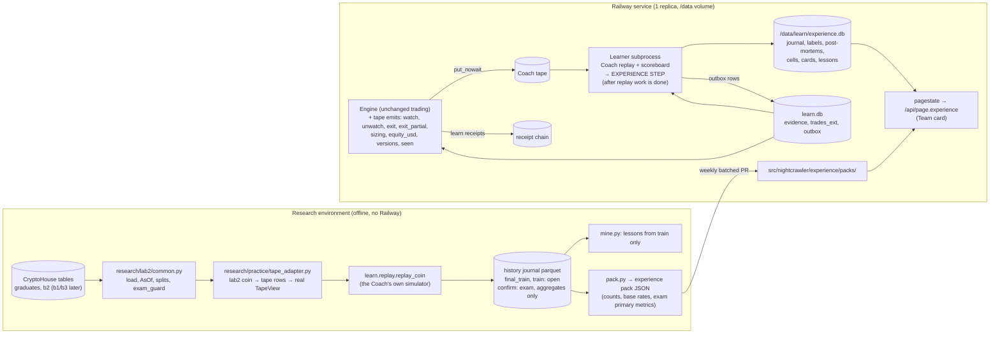

# The experienced team: practice record, report cards, loss library and a tested playbook

Revision 2, written 2026-10-09 ~01:00 UTC by the experience architect, after review by two critics (statistics and
feasibility). This is a design only: nothing in the repository was changed. Once accepted, this file becomes
`docs/EXPERIENCE.md`, and `docs/DESIGN.md` gains a §14 "Experience" that points to it.

**Inputs read and checked for this revision:**

- **Repository, deploy branch `claude/nightcrawler-memecoin-bot-Gwnb1S` at 510f347.** The repository has no `main`
  branch. Every push to the deploy branch redeploys Railway, research snapshots included.
  - Docs: `README.md`, `docs/DESIGN.md`, `docs/LEARNING.md`, `docs/ACCOUNTS.md`, `docs/GOING_LIVE.md`.
  - Code in `src/nightcrawler/`: `engine.py`, `models.py`, `config.py`, `cocoon.py`, `radar.py`, `crawler.py`,
    `strategy.py`, `risk.py`, `backtest.py`, `costs.py`, `page.py`, `pagestate.py`, `teamroom.py`, and `learn/`
    (`replay`, `tape`, `store`, `job`, `card`, `gate`, `evidence`, `variants`, `seeds.json`, `families/placebo`).
  - Tests: `tests/test_learn_boundary.py`.
  - The one-page dashboard (340f163) and Coach phase 1 (94be8cb) are merged. The dashboard branch
    `worktree-wf_19621a20-740-1` differs from the deploy branch by 3 lines in `page.py` and 5 in `pagestate.py`.
- **Research:** `research/lab2/common.py`, the G1/S1/D1/M1 PREREGs and status files, `research/lab2/trials.json`
  (2,576 counted trials, 15 runs, no VAL shortlist yet), `research/flow/README.md`, `FLOW/manifest.json`
  (00:54 UTC) and `research/lab/RESULTS.md`.
- **Scratchpad:** `ideas/PLAN.md`, `flow/AUDIT.md`, `learning/LEARNING.md`, and in `experience/`: `GROUNDED.md` (the
  91 craft rules grounded into 62 rows) and `research-deliberate-practice.md`.

**Reference codes.** **G01-G62** are GROUNDED rows, **AO-1 … AO-11** its as-of rules, **D0-D5** its data codes and
**N1-N8** its notes. **"DP fact n"** is a measured fact in `research-deliberate-practice.md` §1. **A1-A11** and
**B1-B14** are the critics' blocker and major findings, resolved in §2.

---

## 0. In plain words (for the owner)

You asked for a team that is "really, really highly experienced with trading". For a bot, experience is not a feeling
and not a winning pattern. It is four things we can count and check.

1. **Practice.** How many real coin situations the team has worked through with a known outcome. Every decision
   counts, including the trades it chose not to take, and each one is graded after costs.
2. **Exams passed.** Rules that kept working on coins nobody looked at while the rules were written.
   - **Today: none.** The lab tried about 2,576 strategy settings and none passed. That is a real result.
3. **Graded mistakes that change what we test next.** Every trade gets a post-mortem.
   - A pattern of losses that shows up across many different coins becomes a **lesson**.
   - A lesson is a new idea for the lab to test. It never changes the bot by itself.
   - One bad trade changes nothing, unless it exposes a bug.
4. **Honest report cards.** Each team member is compared with a "dumb" stand-in:
   - the Strategy against buying at a random moment on similar coins;
   - the rug filter against a coin flip that blocks just as often;
   - the danger radar against getting out at random times.

   A card says **"Skill shown"** only when a strict check rules out luck, at 99% or stricter.

**What changes for you:**

- **Phase 1 (buildable now, about two days of work):**
  - The team is graded on every new pump.fun graduate the Coach already records: about 1,200 coins a day.
  - Every paper trade and every practice trade gets a post-mortem.
  - Report cards appear inside the Team card of your page.
  - The tested-rules list (the playbook) appears, marking which rules in the bot our data contradicts.
- **Later, as the history download finishes:**
  - The team practises on past days.
  - It takes **one** exam on 15 past days it has never seen: Sept 16 to Oct 1.
  - Past days the lab has already used are practice, never exams. That includes the census day.

**What the page will say, and why that is good news:**

- **Today:** "Practice record: 0 new coins graded over 0 days; 450 past coins practised (1 day, first 3 hours after
  graduation only). Skills shown (99% check): 0 of 4." Then: "Making money: not shown yet — holding cash." The number
  of new coins graded starts growing about 3 days after this ships.
- **Most cards will say "No skill yet" or "Collecting", and some will say "Worse than chance".** Our evidence already
  points that way:
  - the dip strategy lost on every test;
  - the rug filter's hard checks never fire on real pump.fun graduates;
  - the radar's creator-watch would have caught 0 of 9 rugs.

  That is the record talking. An experienced trader's first skill is knowing when *not* to trade.
- **Avoiding losses is not the same as making money.** The money line keeps saying "holding cash" until the Coach
  shows, on coins it had never seen, that a strategy makes money after costs.

**What never changes:**

- Learning can turn real trading **off** on its own, never **on**.
- Risk limits and the kill switch are never learnable.
- Every lesson goes to the lab as an idea to test, never straight into the bot.

**An analogy.** Pilots are trained like this:

- simulator hours (practice);
- a logbook that cannot be padded (receipts);
- incident reports (post-mortems);
- a checkride on a route never flown before (the one exam).

A pilot is rated only after the checkride.

---

## 1. Starting facts, checked against the code and data on 10-09

| # | Fact (source) | Consequence for this design |
|---|---|---|
| F1 | **History data (manifest, 00:54 UTC).** 5,190 graduates. Curve hours run 10-04 18:00 → 10-08 23:00; B2 bars 10-04 21:00 → 10-08 23:00. B1 and B3 hold 0 coins. lab2 TRAIN (10-01 → 10-05) is still mostly missing (D2, about 300 queries). CONFIRM (09-16 → 10-01) is not downloaded | History practice runs today on the census day's `final_train` only (debug), then on `train` when D2 lands. No exam is possible before the CONFIRM backfill and its B2 extension (§4.3) |
| F2 | **The census day is not unseen.** `final_val` was searched by wave 1, and the deliberate-practice research measured its facts on `final_train` + `final_val` (ICC 0.13, the −15.7% cell, BSS 0.19). `final_test` was opened once by the lab1 judge, and the dip Strategy already sat it (1 trade, −22.1%) | No member exam ever runs on `final_val` or `final_test`. They are "already-seen data" (§4.3) |
| F3 | **lab2 holdouts are unused.** `trials.json` has 15 runs (14 on `final_train`, 1 on `train`), no `val_shortlists`, and no VAL or TEST run | Experience publishes nothing computed on `val` or `test` before every wave-2 hypothesis has taken its run there (§4.3) |
| F4 | **B2 bars cover only [g, g + 180 min)**, where g is the graduation time. The bot enters ≥ 60 min after **creation** and holds up to 120 min | History practice in the bot's own window needs B2 extended to g + 8 h ("P2b", §10). Until then, history practice covers only the first 3 hours and is labelled that way. It grades nobody |
| F5 | **The learner process may not load trading modules.** `tests/test_learn_boundary.py`: `PROCESS_FORBIDDEN` lists `crawler`, `cocoon`, `radar`, `judge`, `http`, `ledger`, `engine`, `broker` and `wallet`, and the source-AST rule also forbids `risk`. `cocoon.py` imports `judge`, `sources` and `sources.rugcheck`; `radar.py` imports `sources` | Phase-1 experience imports none of these. It grades the Cocoon and the Radar from the verdicts the engine already tapes. Pure rule modules are a phase-2 refactor (§11, B1) |
| F6 | **The learner child receives only `CHILD_SETTINGS`** (`learn/job.py`): data_dir, the learn settings, `paper_slippage_bps`, `max_price_impact_pct`, `log_level` and the strategy fields | Member version hashes come from an engine `versions` tape row, not from Settings inside the learner. Risk replays in the learner wait for phase 2, which extends `CHILD_SETTINGS` (B3) |
| F7 | **What the engine tapes.** `_decide` emits only `enter` and `reject_*` rows, with `safety {passed, hard_fail_reasons, warnings, unverified}` and the judge verdict. `watch`, `unwatch`, `exit`, `exit_partial` and `hold` are not taped. `_decision_row` drops `inputs.sizing`. The equity `lag` row carries only `sol_usd` | One small engine PR adds tape emits only (§11, PR-E). No trading behaviour changes |
| F8 | **The Coach replay keeps little per trade.** `replay_day` stores the first trade's evidence (`x`, `x_raw`, `x_stress`, `gross`, `cost`, entry and exit ts) and discards `Outcome.reason` (the exit reason) and `Outcome.decisions` | The G22 PR also stores a side table of exit reasons and decisions, so the `sim_hash` changes once (§11, PR-S) |
| F9 | **Replay CPU (critic B, measured in the sandbox).** About 85 ms per coin for `dip_rebound` and 9-19 ms for the placebo. The Coach's 4 dip variants plus the placebo use most of the 600 s budget | Experience never re-replays. It adds one cheap control (`placebo_wide`) and reads the Coach's outputs (§10) |
| F10 | **The simulators book stops at min(level, close)** (G22). Rug stops booked at −51% to −59% were really −84% to −97% (RESULTS A3) | No grade counts until G22 lands (E0). It is the only prerequisite, and it is zero-risk to live trading |
| F11 | **One outcome says almost nothing** (DP facts 2-5). A zero-edge rule wins 79% of single trades. 16 replays of a coin are worth about 5.4 independent ones (ICC 0.13). An unmatched post-mortem "found" a re-entry mistake (−4.6 pp) that vanished once matched (−0.4 pp [−1.8, +1.1]) | Grades are means with honest bands over days. Lessons test features over **all** trades, winners included (§6.5) |
| F12 | **The placebo control already exists.** `families/placebo.py` enters each coin once, at a hash-chosen offset in [created + `min_age`, + 6 h), with the benchmark's universe check, exits and costs. `variants.make_spec` already marks any spec that loosens an anchor as `promotable = False` | The forward random host is free. A loosened copy (`placebo_wide`) gives the Crawler's gate something to be measured on (§4.2) |

**E0 (the only prerequisite)** means: G22 is merged, with the replay side table (PR-S). The other GROUNDED P0 items
(G01 Mayhem, G12 age from graduation, G33 blind exits, G23 L_max arithmetic, G39 text) are safety PRs of their own.
They are reviewed separately, and experience does not wait for them (B9).

---

## 2. Decisions taken after review

Every blocker and major finding is fixed. Where the fix is a choice between the critics' options, the choice and its
reason are given.

| # | Finding | Decision (where) |
|---|---|---|
| A1 | Mistake classes are defined by outcomes, so "flagged vs unflagged" always differs | Loss types are **descriptive only**, each shown next to a luck-only base rate from random entries in the same situations. Lessons test **pre-decision features** over all trades, winners and random entries included, with precision and lift. A pure-noise-feature test is required (§6.3, §6.5) |
| A2, B5 | The census-day "sealed" thirds were already seen; val/test aggregates would leak; lessons could be tested on the split that produced them | No exam on `final_val` or `final_test`. Experience never touches `val` or `test`. The only history exam is one run on `confirm`, primary metric only, after every wave-2 hypothesis has taken or closed its CONFIRM run. Nothing from a sealed split opens a lesson. Lessons are tested on forward coins created after the lesson receipt. Exams use their own ledger, outside the wave-2 deflated Sharpe ratio (§4.3) |
| A3 | Crawler "skill" came from where the random host was placed | The Crawler gets a **bar** card (coverage), not a skill card. Its gate value is measured on the `placebo_wide` host and worded as a check of a pattern known in advance (KP-1). The "probably 1 of 7" forecast is deleted. History never sets a label (§5.2) |
| A4 | Radar's DS = 0 baseline rewards any early exit while prices drift down | DS is measured against **placebo exits** drawn from the Radar's own exit-time distribution. A null test runs on a down-drifting tape (§5.2) |
| A5 | Broker and Risk become "skilled" by construction | Broker is `not_measured` on paper whatever the numbers say. Live, it is graded against the pre-ratchet cost model. Risk is a **bar** card: a ruin tolerance line plus a comparison with random skipping at the same trade count and stake. Neither counts in "Skills shown". Chip words depend on the card kind (§5.1, §9) |
| A6 | History bands with 1-2 day clusters are too narrow | Every card needs ≥ 7 distinct UTC days. History results come only from `confirm` (15 days) and use a 99% t-interval over day values (df = days − 1). They are shown as a "past-data check" and never counted (§5.1) |
| A7 | Many chances at "skilled" with no combination rule | The forward claim is the only label. Each member has a lifetime α ledger, α_v = 0.02 / (v(v + 1)) across versions, receipted. An earlier version's results are greyed out. Test: null data with 10 version changes gives P(ever skilled) ≤ 1% (§5.1) |
| A8 | Track F bar: an empty OOS criterion, in-sample winner share, coin-only CI, no multiplicity control, stacking | OOS veto value is compared with a random veto at the same rate, with an operator × day CI lower bound > 0. Winner share is checked OOS. Bot-host non-inferiority ≥ −1 pp, else adopted as a logged feature only. Family-wide **e-LOND at 10%**. The whole stack is re-tested before each adoption. "Trades taken" is always shown beside paper P&L (§7.2) |
| A9, B7 | √DE uses a day ICC that cannot be estimated | Forward bands run on **day-block means**, which are close to independent. No ICC is estimated on train or on sealed splits. n_eff appears only in the details, as "about", once ρ_day comes from ≥ 15 forward days (§4.7, §5.1) |
| A10 | Lesson mining has no multiplicity control | Each (feature, cell) group has an anytime-valid e-process. A weekly e-BH at 10% runs over the groups examined. A group opens at most once per taxonomy version. The mined effect is marked "selected (biased upward)", and the PREREG plans power on half of it. The number of groups examined is logged (§6.5) |
| A11 | Words claim more than the evidence earns | New templates: "Graded on", "Skill shown (99% check)", the lift shown first, a correct VV sentence, no trend word without a receipted claim. The lint is extended and uses word boundaries (§8) |
| B1 | The learner cannot import Cocoon, Radar or Risk | Phase 1 imports none of them. Cards use engine verdicts from the tape. Pure `rules/` modules come in phase 2 as move-only PRs with parity tests on recorded real inputs (§11) |
| B2 | Ledger data is out of the learner's reach | PR-E adds `sizing` to decision rows, `equity_usd` to the equity `lag` row and a `versions` row at boot. The learner turns a new member hash into a `member_version` outbox row, whose receipt sets `t0`. Ledger-only checks (limits replayed against receipts) move to phase 2 (§4.6, §11) |
| B3 | Learner Settings default silently | Phase 1 needs no extra Settings in the learner. Phase 2 extends `CHILD_SETTINGS` and adds a fingerprint-equality test (§11) |
| B4 | CPU underestimated 20-40× | No re-replay. The side table lands in PR-S. Experience runs only after the Coach's replay work is done, under the Coach's `_Stopper`, and must pass a measured ≤ 60 s/day benchmark (§10) |
| B6 | Cocoon-H shows almost nothing | Cocoon-H is dropped from phases 1-2. The real Cocoon is graded forward from `watch` and `reject_cocoon` rows. Mayhem detection is graded separately, as a G01 confusion matrix on the full `graduates` table (§5.2, §11) |
| B8 | Dependency ordering errors | PR-E lands before Coach phase 2 touches `engine.py`, or is folded into it. History practice needs no member refactor. G12 is its own PR covering crawler, engine, replay and backtest together. Each team is a distinct agent. The branch name is corrected. Packs and playbook changes are batched weekly (§11) |
| B9 | Live-trading changes were bundled in | G01, G12 and G33 are separate reviewed PRs, not experience prerequisites. The Cocoon refactor is deferred and will be move-only (§1, §11) |
| B10 | The exam guard bypassed lab2 | A small `common.exam_guard(member, split, config_hash)` API and a separate `research/practice/exams.json` ledger, approved by the lab owner. The `research/practice` src-import exception is written into `common.py`'s contract. Lessons handed to the lab report results under both exit-delay settings (§4.3) |
| B11 | No forward data for the Crawler's gate | A second control, `placebo_wide`, with loosened research-only anchors. It is non-promotable and spends no α (`make_spec` already handles this). It is added in PR-S (§4.2) |
| B12 | Fetches with no owner | Experience makes **no** external calls. Forward current-state capture has one owner: Coach phase 2's `safety` and `quotes` streams, merged with PLAN FW1/FW2. Cards that need them stay `not_measured` until then (§10) |
| B13 | `cells.json` in the entry path | The engine never reads learner files. Plans are computed after the fact from the newest cell snapshot whose root was receipted **before** the decision (§4.6) |
| B14 | Scope too large | Phase 1 is a slice of about two days. Everything else is phased, with a named data gate (§11) |

**Minor findings, all adopted:**

- **Coach card.** The forecaster and its trivial baseline are defined separately. Coverage is measured on predictive
  quantiles. The Coach is never shown in green unless it beats the trivial forecaster.
- **Mayhem.** Counted as a universe definition, not a judgment. `unknown` means pass in VV, and the share of
  `unknown` coins is shown.
- **Attribution.** Part a is split into "market" (charged to nobody) and "cell choice" (charged to the Crawler).
- **Playbook statuses.** `contradicted` is split from `unsupported`.
- **Strategy controls.** Drawn from the same eligible set as the trades. On history, the S host is labelled "proxy
  (no pre-graduation candles)".
- **Exam configuration.** The exam config hash covers all practice code. The one-run guard is keyed on (member,
  split).
- **Crash labels.** Bar-based for every coin, with persistence required.
- **Authority revocation.** It counts only when it happened at creation (later Cocoon-H).
- **`seen` rows.** Compact, and read from D−1 to D+1.
- **B1 limits.** B1 stops at g + 120.
- **Storage.** 60 days of typed rows with a self-enforced cap. The two-database writes are made idempotent, and
  experience failures are isolated from the Coach.
- **History windows.** CryptoHouse windows wait for phase 2.
- **Lint.** Uses word boundaries, with per-card chip words and one headline template.
- **Citations.** Fixed. `learn/labels.py` is created now and imported by experience, not the other way round.
- **Playbook source.** Generated from GROUNDED.

---

## 3. Architecture



**Seam invariants.** Each one has a test (§11).

| # | Invariant |
|---|---|
| X1 | **Experience never trades.** It never writes Settings, specs or code. In phases 1-2 it has no effect on trading at all. From phase 2 its only effects are the OFF-only events of §7.5, sent through the Coach's gate |
| X2 | **It runs inside the learner boundary.** `nightcrawler.experience` imports nothing that `test_learn_boundary` forbids to learn modules (`broker`, `wallet`, `risk`, `judge`, `http`, `sources`, `ledger`, `engine`, `crawler`, `cocoon`, `radar`, `dashboard`). It may import `learn.*`, `strategy`, `models`, `costs`, `backtest` and `hashing`. Phase 2 adds `nightcrawler.rules.*` (pure) |
| X3 | **As-of everywhere.** A member input at decision time t comes from `TapeView(as_of=t)` (forward) or from lab2 `AsOf` with τ = t − 20 s (history). Outcomes are labels, readable only after `label_ready_ts` (AO-8) |
| X4 | **Forward-only claims.** A forward claim counts only coins created after the member version's `t0`, taken from the receipt of its `member_version` outbox row |
| X5 | **Holdout discipline.** Experience reads `final_train` (debug) and `train` freely. It reads `confirm` once per member through `exam_guard`, aggregates only. It never reads `val`, `test`, `final_val` or `final_test` before the condition in §4.3. The lesson miner raises `SplitLocked` on anything but `train` and forward rows |
| X6 | **Only the engine writes receipts.** Experience events go through the learn outbox (LEARNING S2). Every outbox row has an idempotency key (kind, key), and every fold keeps the first row per key |
| X7 | **Trading never waits.** Engine emits use `put_nowait`. The engine reads no experience file. Decisions are identical with experience on or off |
| X8 | **Failure isolation.** The experience step is lazily imported and wrapped. An error or timeout records `experience.last_error` and never changes the Coach run's `status`, scoreboard or lease |
| X9 | **Storage is bounded.** `experience.db` stays ≤ 150 MB on the volume, enforced by experience itself until the Coach janitor exists |
| X10 | **No hype.** Every owner-facing string comes from fixed templates that pass the word-boundary lint (§8.4). No win rate appears anywhere |

---

## 4. Practice reps

### 4.1 Words used below

- **Situation:** a (coin, decision time t) pair, with everything knowable at t.
- **Rep:** one situation pushed through every team member that can be replayed for it. It produces each member's
  verdict and the counterfactual outcome after costs.
- **Member hash:** sha256 of a member's source bytes plus its public Settings subset, computed **by the engine** at boot
  and taped in the `versions` row. Members: crawler, cocoon, radar, strategy (Settings strategy fields), judge (prompt
  sha, model, mode), risk (risk Settings), broker (mode, `PAPER_SLIPPAGE_BPS`). `team_hash` is the hash of all seven.
- **Version v of a member:** the v-th distinct member hash seen on the tape. Its `t0` is the receipt time of its
  `member_version` outbox row.
- **Hosts** (entries replayed per coin):

  | Host | What it is | Why it exists |
  |---|---|---|
  | **S** | The team's own entry rule: the Coach's benchmark variant (the Settings strategy paper trades), or the champion once one exists | Grades the Strategy and its exits |
  | **R** | The Coach's existing `placebo`: one entry per coin at a hash-chosen offset in [created + `min_age`, + 6 h), the benchmark's universe check, exits and costs | Random entries inside the bot's own window. Gives every coin an outcome, so vetoes can be graded |
  | **W** | New control `placebo_wide`: the placebo with the age, mcap and liquidity anchors loosened to their hard-range floors and ceilings | Gives coins the Crawler's rules would refuse an outcome, so the gate can be measured. Non-promotable and α-exempt by `make_spec` |
  | **H1** | History only: 4 entries per coin at t = g + 6 min + (sha256("H1:" ‖ mint ‖ k) mod 49 min), k = 0-3 | First-hour **practice** while B2 ends at g + 180. It grades nobody, because it overlaps the Crawler's cut variable (A3) |

- **Team trade:** an S trade on a coin the engine's Cocoon passed before the entry. Paper trades are team trades by
  construction.
- **Counterfactual:**
  - for a vetoed S signal: the S replay's outcome on that coin;
  - for a coin without a signal: its R outcome.

### 4.2 Forward practice (Railway, phase 1)

- **Coins.** The Coach tape universe: graduated-census coins that are SOL-quoted and not Mayhem, on days ≥ 95%
  complete (LEARNING §3.5).
- **Replays.** The Coach's own `replay_day` runs the S and R hosts already. PR-S adds the W host as a seed, and
  `trades_ext(variant_hash, mint, t_dec, t_in, t_out, exit_reason, partials, decisions_json)` as a side table. That
  table holds the first trade's exit reason, partial exits and every ENTER signal, including those refused at the
  fill.
- **What experience adds.** Experience reads `evidence` + `trades_ext` + the tape through `TapeView` and adds, per
  (coin, host): gatekeeper verdicts as of entry, cell keys, labels, plan forecasts and post-mortems. It runs no
  Backtester pass of its own except one zero-delay, zero-cost replay per graded team trade (attribution step d,
  §6.2).
- **Engine verdicts joined by mint and time:**
  - Cocoon: the `watch` (pass) and `reject_cocoon` rows, with `safety.hard_fail_reasons` and warnings;
  - Radar: `reject_radar` rows, and `exit` rows whose reason starts with the radar prefix;
  - Jev: the `verdict` on decision rows;
  - Risk: `reject_risk` rows plus `sizing`;
  - Broker: `fills` rows with `decision_ts` and the quote.

  A verdict counts for a host entry only if its decision ts ≤ that entry's t_dec. Otherwise the member is `unchecked`
  for that entry, which is an outcome-independent rule.
- **Paper trades.** They are rebuilt from `fills` (buy and sell legs) and `exit` rows. The learner never reads the
  ledger.

### 4.3 History practice and the one exam (offline)

**One simulator for both worlds.** `research/practice/tape_adapter.py` turns a lab2 `CoinData` into tape-shaped rows:

- one `universe` row from `graduates` (launch fields known at creation);
- `candles` rows from `b2_bars` (OHLC and volume, minute timestamps);
- `first_seen_ts := g + 300 s`, the recorder's worst-case census poll.

It then builds a real `TapeView` and calls `learn.replay.replay_coin` with the same variants and the same `sim_hash`.
`TapeView` applies the candle visibility rule m + 60 + L_obs.

- **Censoring.** If t_in + `max_hold` + one bar exceeds the window end (g + 180, or g + 8 h after P2b), the entry is
  `censored` and has no outcome. The test uses the entry time only, never the outcome. The adapter therefore treats
  replay's `missing` as censored only when that entry-time rule already applies. Anything else is a data error and
  stops the run.
- **Labelled proxies.**
  - The S host is "proxy (no pre-graduation candles)". The 6-h dip high is measured from g onward, while live
    pump.fun candles include the curve phase.
  - `ratio_m5` is rebuilt from B2 `n_buys` / `n_sells` over the last 5 closed minutes, dust included, as DexScreener
    counts them.
- **No Cocoon, Radar or Jev on history in phases 1-2.** They are recorded as `not replayed` (§4.4).

**Split access** (the lab2 calendar; experience adds no split of its own):

| Split | What experience may do | Guard |
|---|---|---|
| `final_train` (census third, 450 coins) | Debug practice, H1 host only. Shown as "practice". No lessons, no exam | `DEBUG_SPLITS` |
| `train` (10-01 → 10-05) | Full practice journal, post-mortems of H1 and S-host trades, loss-type base rates, **lesson mining**. Never a label | none |
| `confirm` (09-16 → 10-01, 15 days) | **The one exam per member** ("past-data check"). Primary metric and band only. Needs E0, P2b on these coins, and the wave-2 condition below | `common.exam_guard` + `research/practice/exams.json` |
| `val`, `test` | Nothing until every wave-2 hypothesis registered by then has taken its run there or is `closed` in its `status.json`. After that: "already-seen practice" (descriptive counts only), never an exam or a lesson source | `SplitLocked` in practice code |
| `final_val`, `final_test` | Never an exam for any member that existed in wave 1 (all of today's). May appear only as "already-seen data" counts | `SplitLocked` |

**The exam guard (agreed with the lab owner before T5 starts).** `common.exam_guard(member, split, config_hash)`:

- writes and locks an entry in `research/practice/exams.json`, a ledger separate from `trials.json`, so the wave-2
  deflated Sharpe ratio is not affected;
- refuses a second run for the same (member, split), whatever the config;
- returns a token that `common.load(split, exam_token=…)` accepts in place of the environment flag.

The `config_hash` covers:

- the member hash;
- the `sim_hash`;
- `tape_adapter.py`, `learn/labels.py` and `experience/constants.py`;
- the host formulas;
- the bootstrap seed;
- the data manifest root.

It is committed in a pushed PR **before** the split is loaded. If the lab owner declines the guard, there are no exams,
and history stays practice only.

**What an exam publishes.** Per member: the primary metric, its 99% t-interval over day values (df = days − 1), n
coins and n days. There are no cell tables and no per-rule numbers. An exam can never open a lesson.

**The `src` import exception.** `research/practice` may import, read-only, `nightcrawler.learn.{replay, tape,
evidence, labels}`, `strategy`, `models`, `costs` and `backtest`. It is written into `common.py`'s contract with the
lab owner's approval. lab2 itself still imports nothing from `src/`. If approval is refused, practice vendors these
modules with a byte-for-byte parity test, the pattern `costs.py` already uses.

**Coverage over time** (counts of usable coins are estimates):

| Stage | Practice | Exam |
|---|---|---|
| Today | `final_train` 450 coins, first 3 h | none |
| D2 lands (≈ 4 h of quota) | + `train`, about 3,500 coins, first 3 h | none |
| P2b on `train` + `confirm` (≈ 6-9 h of quota, after P4) | `train` in the bot's window | `confirm`, about 13,000 coins over 15 days, once per member |
| After wave 2 has used `val`/`test` | + about 2,800 "already-seen" coins | none |

### 4.4 The team member by member

| Member | Forward (phase 1) | History (phases 1-2) | Later (phase 3, data-gated) |
|---|---|---|---|
| **Crawler** | Its rules as the replay's universe check (age, mcap, liquidity as of t, on all hosts). Coverage from the engine's compact `seen` rows | The same universe check on the adapter's candles | — |
| **Cocoon** | The engine's real verdicts (`watch` / `reject_cocoon`, rule ids, warnings) on coins it checked; `unchecked` otherwise | `not replayed` | Cocoon-H after the `rules/cocoon_rules.py` refactor. Rules that can fire on the graded universe only. Authority "revoked" counts as a pass only when revoked in the create transaction |
| **Strategy** | The Coach's benchmark replay (exact) and paper trades | `replay_coin` on adapter candles (proxy, see §4.3) | — |
| **Exits** | The benchmark's exits in replay, and paper exits from `exit` rows | Same | — |
| **Radar** | Real verdicts: `reject_radar` rows and radar `exit` rows on paper positions | `not replayed` | Radar-H on B1 after P4, stopped at g + 120 (B1 ends there). Pooled accounts, `SUSPECT_PDA_ACCOUNTS` and failed transactions are excluded using lab2's constants |
| **Jev** | Verdicts on decision rows; `not_measured` while the judge is off (the default) | `not replayed` | The masked offline audit (G47, 400 situations, about $6, with the owner's OK) |
| **Risk** | From paper fills, `sizing` and `equity_usd`: per-rug hit, worst day against the limit, trades taken | — | Phase 2: a portfolio replay through pure `rules/risk_rules.py` (ruin, limits held) |
| **Broker** | Paper fills: decision-to-fill latency. Slippage is `not_measured` on paper | lab2 cost model, not graded | Phase 2 quote probes; live fills |

### 4.5 Labels (exact definitions; `src/nightcrawler/learn/labels.py`, shared with Coach phase 3)

- **x:** the net return of a $20 trade, `proceeds / stake − 1`, after every cost, clipped to [−1, 1]. `x_raw` is kept.
  **g** is the gross return at mid prices on the same path.
- **Data source.** Every label of every coin comes from the same source: closed 1-minute bars (tape candles forward,
  B2 bars on history). Swap-level drops are a secondary diagnostic only.
- **`crash50(t, H)` = 1** if some closed minute m in (t, t + H] has `low_m ≤ 0.5 × close_{m−1}`, **and** the close 5
  minutes later is ≤ 0.6 × `close_{m−1}`. The second condition keeps sandwich and MEV wicks out. `t_crash` is m.
- **`dead(t, H)` = 1** if the last close at or before t + H is ≤ 0.2 × the price at t.
- **bad** = `crash50` ∨ `dead`. **good** = the coin's R-host x > 0, i.e. a random entry with our exits made money after
  costs.
- **mfe and mae:** the best and worst points of each trade, from closes; `mae_wick` from lows.
- **Horizon.** H = 6 h forward. On history, H runs to the window end. `label_ready_ts = t + H + 10 min`, and forward
  labels are read only on days the Coach has judged.
- **Shared code.** The functions are pure, stdlib-only, with horizons as parameters. Coach phase 3's horizons (5 m,
  30 m, 2 h, 6 h) call the same code. `learn/labels.py` is created now by O8, with O7 reviewing, and experience
  imports it. learn never imports experience.

### 4.6 The journal, cells and sealed plans

**Journal.** There is one row per (mint, host, `team_hash`): typed columns, small JSON only where noted. Forward rows
go to `experience.db` `journal`, history rows to `FLOW/practice/<split>.parquet`. The row **references** the Coach's
evidence and does not copy it.

| Group | Columns |
|---|---|
| Identity | `mint`, `source` (`forward`, `paper`, `history`), `split`, `host` (S, R, W, H1), `seed_k`, `variant_hash`, `evidence_key` (variant_hash, mint, pricing), `team_hash`, `sim_hash`, `data_root` |
| Times | `created_ts`, `first_seen_ts`, `t_dec`, `t_in`, `t_out`, `exit_reason`, `censored` |
| Cell (at t_dec) | `speed` (`fast`: first_seen − created ≤ 10 min forward, or g − created ≤ 60 s on history; `slow`; `unknown`), `age_band` (0-30, 30-120, 120-360, > 360 min since first_seen forward or g on history), `mcap_tier` (< $100k, $100k-500k, ≥ $500k) |
| Verdicts | `crawler_ok`, `crawler_why`, `cocoon` (pass, fail, unchecked), `cocoon_rules`, `cocoon_ts`, `radar_pre` (pass, flag, n/a), `radar_exit_ts`, `jev` (yes, no, n/a), `risk_admitted`, `size_usd`, `equity_usd`, `decided_by` (first member that stopped the trade, or `traded`) |
| Outcome | `x`, `x_raw`, `x_stress`, `g`, `cost` (for a vetoed trade, the counterfactual) |
| Labels | `crash50`, `t_crash`, `dead`, `mfe`, `mae`, `mae_wick`, `label_ready_ts` |
| Plan (S host, paper) | `p_stop`, `p_crash50`, `q10`, `q50`, `q90` of x, `cells_root` |
| Links | `pm_id` |

- **Size.** About 300 B per row, 3 forward rows per coin: about 1.1 MB a day.
- **Daily root.** Each judged day, an outbox row `journal_root` {day, Merkle root, team_hash, sim_hash} (key: day)
  becomes a `learn` receipt. The record cannot be edited once outcomes are known.

**Cells and sealed plans (G56), without touching the entry path (B13).**

- **The cell table.** Each judged day, experience builds as-of cell tables from forward R-host rows with
  `label_ready_ts` ≤ the snapshot time. Per cell they hold: n, mean x, stop rate, crash50 rate, and the q10/q50/q90 of
  x.
- **Receipting it.** Its Merkle root goes out as outbox row `cells_root` {snapshot_ts, root} and is receipted.
- **Forecasts after the fact.** For every `enter` row and S trade, the learner computes the plan **after the fact**
  from the newest snapshot whose receipt time is **before** t_dec. Everything the plan uses was receipted before the
  decision: the code hash, the snapshot root and the decision inputs. That makes it as binding as a seal written into
  the entry receipt.
- **Before 7 forward days** the plan fields are NULL ("no situation history yet").
- **Phase 1 forecaster.** It is only the cell base rate, which is why the Coach card says "no forecaster yet" (§5.2).

### 4.7 Counting practice honestly

**Counters** (per member, per source):

- `coins_graded`: forward coins with ready labels on which the member acted;
- `trades_graded`: team and paper trades with a post-mortem;
- `days`: distinct judged UTC days;
- `coins_practised`: history coins, shown separately with their window ("first 3 hours only" before P2b);
- `exam`: {split, version12, date, result} or none.

**Independent situations (G53).**

- Not shown on the headline.
- In the card details it appears as "about N independent situations (estimated)". That needs ≥ 15 forward days, and
  it is computed as n / (1 + (m_day − 1) ρ̂_day + (m_op − 1) ρ̂_op).
- ρ̂ comes from forward days only, never from `train` (4 days) or sealed splits.
- Before then the card shows "N coins on D days".

**Day blocks** (used by every band, §5.1):

- Consecutive judged UTC days are merged into blocks until each block holds ≥ `BLOCK_MIN` units: 20 coins for
  coin-level cards, 5 trades for trade-level cards. The merging depends on counts only.
- **Operator cap.** Within a block, no operator contributes more than 30% of the units (`CLUSTER_MAX_SHARE`). The
  excess is dropped in hash order. An operator is the creator, else the normalized ticker family.

### 4.8 What is reused (no duplication)

| Need | Reused from |
|---|---|
| Forward data, as-of views, seals | `learn/tape.py` (`TapeView`, `TapeReader`) |
| S, R and W outcomes | `learn/replay.replay_day` evidence + `trades_ext` (PR-S) |
| Version identity, forward-only rule | `register` / `t0` pattern of `learn/variants.py` and `store.mark_outbox` |
| E-processes, lower bounds | `learn/evidence.py` (`step_up`, `step_down`, `lower_bound`, `LAMBDAS`) |
| Outbox, lease, stopper, rlimits | `learn/store.py`, `learn/job.py` (`_Stopper`, `apply_limits`) |
| History universe, splits, as-of, pooled accounts | `research/lab2/common.py` (`load`, `AsOf`, `SPLIT_BOUNDS`, `POOLED_ACCOUNTS`, `SUSPECT_PDA_ACCOUNTS`) |
| History simulator | `learn.replay.replay_coin` via `tape_adapter.py` (one simulator, one `sim_hash`) |
| Costs | `src/nightcrawler/costs.py` |
| Labels | `learn/labels.py` (new, shared with Coach phase 3) |
| Card sanitising, scrubbing, caching | `learn/card.py` pattern (`_scrub`, 60 s cache) |

---

## 5. Report cards

### 5.1 Rules common to every card

**Three kinds of card.** Only the first kind can show "skill".

| Kind | Members | Compared with | Labels → chip words |
|---|---|---|---|
| **vs chance** | Cocoon, Strategy, Radar, Jev | A random stand-in with the same rate or timing | `not_measured` "Not measured" · `not_enough` "Collecting" · `no_skill_yet` "No skill yet" · `skilled` "Skill shown" (green) · `worse` "Worse than chance" (red) |
| **vs bar** | Crawler, Broker, Risk | A fixed, written-down standard | `not_measured` · `not_enough` "Collecting" · `meets_bar` "Meets the bar" (green) · `below_bar` "Below the bar" (red). Risk uses "Within tolerance" and "Over tolerance" |
| **self-check** | Coach, Receipts | Built-in controls | `not_built` "Not built yet" · `checks_pass` "Checks pass" (grey, never green) · `check_failed` "Check failed" (red) |

**Labels.** Use the first one that applies:

1. `not_measured`: no data source yet.
2. `not_enough`: below the card's minimum, or fewer than **7 distinct UTC days** (the same floor on every card).
3. `worse` / `below_bar`: the band lies entirely on the bad side of the baseline or bar.
4. `skilled` / `meets_bar`: the band lies entirely on the good side **and** the stability veto passes.
5. `no_skill_yet`: otherwise. A bar card stays at "Collecting" here.

**The band (forward, the only source of labels).**

- **Statistic.** Each card's primary statistic is computed per day block b as a value y_b, rescaled into [−1, 1].
- **Construction.** The two-sided band is the always-valid bound of `learn/evidence.lower_bound` applied at α_v / 2
  to y and to −y.
- **Why day blocks.** Blocks are close to independent and need no ICC (A9).
- **The cost.** Labels arrive more slowly than a per-coin band would allow. That is accepted.

**Error budget per member (A7).**

- **Lifetime budget.** Version v of a member gets α_v = 0.02 / (v(v + 1)), so the versions together spend at most
  0.02. That bounds the lifetime chance of a false "Skill shown" at 1%, and of a false "Worse than chance" at 1%.
- **Version 1** uses α = 0.01: the "99% check".
- **Registration.** Each version's claim is an outbox `skill_claim` {member, version, metric, α_v, t0} (key: member,
  version). It is receipted before any of that version's evidence counts.
- **The fold.** The α ledger is a fold over these receipts, like the Coach's ledger. The card details show the budget
  left.
- **The team as a whole.** Across the 4 vs-chance members, P(any false "Skill shown") ≤ 4%. The page states this in
  the details.

**Stability veto (G54).** The metric has the same sign in both halves of the version's record and in ≥ 75% of weeks
with data. A one-operator burst cannot produce "Skill shown".

**History results (the `confirm` exam).**

- **Shown as** "Past-data check (15 days, version <hash12>): {passed | not passed | worse}", using a 99% t-interval
  over day values.
- **Never counted** in "Skills shown". It never sets the chip.
- **Version change.** The line is greyed when the member's current version differs from the version examined.

**Display.** Each metric shows its value, its band, the baseline or bar, and the label word. The bar drawn is the band
that sets the label. Secondary metrics show a 95% day-block bootstrap "rough range" and never set a label.

**Common statistic for vetoes** (Cocoon, Radar pre-buy, Jev, and the Crawler's gate as a secondary). These are
computed on a host with per-coin outcomes x_i and pass flags P_i.

```
VV_b = mean(x | pass, block b) − mean(x | all checked, block b)    # points per trade; a random veto has E[VV] = 0
y_b  = VV_b / 2                                                    # into [−1, 1] for the bound
RC   = #(blocked ∧ bad) / #bad        # rug catch
FB   = #(blocked ∧ good) / #good      # false block
lift = RC / (1 − pass rate)           # 1.0 = a coin flip blocking as often
```

`unchecked` coins are left out of a member's card and counted ("checked 31% of coins"). A rule whose inputs were
`unknown` (e.g. RugCheck unavailable) counts as a **pass**, because that is what the live member does with warnings.
Fail-closed outcomes count as blocks, because that is also what it does. The share of each is shown.

**Known patterns (fixed now, `experience/constants.py`).** These are effects we already know. A card that mainly
reproduces one says so, rather than claiming skill:

| Code | Pattern | Source |
|---|---|---|
| KP-1 | Random entries in fast coins 0-30 min after graduation lose most (−15.7%) | N5, census `final_train` + `final_val` |
| KP-2 | The dip-rebound family loses after costs | RESULTS F1, N4.9 |
| KP-3 | Factory coins' airdropped supply is dumped at once, about 16 min after creation | AUDIT |
| KP-4 | Mint, freeze, extensions and LP never fail on genuine graduates | G02 (1,542 of 1,548; 100 of 100 RPC) |
| KP-5 | Rug stops fill far below the stop level (−84% to −97% against −18%) | RESULTS A3 |

### 5.2 The cards

Each card gives: kind, primary metric (the one that sets the label), secondary metrics, baseline or bar, data, minimum,
plain words, the **expected first reading** (written down now, so nobody is surprised) and when it becomes available.

#### Cocoon: throws out rugs and scams (vs chance)

| | Definition |
|---|---|
| **Primary: veto value** | VV of the engine's real Cocoon verdict on the **R host** (a random entry inside the bot's window), over coins the engine checked before that entry |
| Rugs blocked | RC, with `bad` measured from the check time. Shown lift first: "blocks rugs {lift:.1f}× as often as a coin flip blocking the same share ({rc10} vs {b10} of 10)" |
| Good coins wrongly blocked | FB: "1 in {round(1/FB)}" |
| Per rule (G08) | The same three numbers for each rule id that was the first reason, with its count. A rule with ≥ 200 blocks whose VV range lies at or below 0 is flagged "no measurable value". The flag nominates a lesson; it never demotes a rule |
| Coverage | "Checked {s}% of graded coins; {u}% of checks had a source unavailable (counted as the live rule treats them)" |
| Baseline | A random veto at the same block rate: VV = 0, lift = 1 |
| Data | Forward: `watch` / `reject_cocoon` rows (PR-E), R evidence, labels |
| Minimum | ≥ 30 blocked, ≥ 30 passed, ≥ 20 `bad` and ≥ 20 `good` checked coins; ≥ 7 days |
| Plain words | "Cocoon checked {n:,} coins on {d} days. It blocks rugs {lift:.1f}× as often as a coin flip blocking the same share ({rc10} vs {b10} of 10). It wrongly blocks 1 in {fb_k} good coins. After its blocks, a random trade in the bot's window changed by {vv:+.1f} points [{lo:+.1f}, {hi:+.1f}] — trades still lose on average. {label_text}" |
| Expected first reading | **About no skill on genuine graduates (KP-4).** Blocks will be rare, so the card says "Collecting" for weeks. The factory airdrop puts 0.036% in each of 2,200 wallets, under every cap, and farm rugs came from 9-13% holders. Mayhem coins are outside the graded universe, so the Mayhem rule is reported separately, as a G01 detection table on the full `graduates` table, not as Cocoon skill |
| Available | Phase 1 (after PR-E) |

#### Strategy: waits for the setup, and decides the exits (vs chance)

| | Definition |
|---|---|
| **Primary: entry edge vs matched random entries** | EE_b = mean over S trades in block b of (x_S − x̄_M), then y_b = EE_b / 2. x̄_M is the mean R-host x over coins from the **same eligible set**: the Crawler's rules passed as of entry, the Cocoon applied to neither side, the same speed class, the same UTC day ± 1, and an entry age within ±5 min of the S trade's age. With fewer than 5 such controls the age window widens to ±15 min, then to the age band. All of this reuses Coach evidence; nothing is replayed |
| Beats costs? | Mean x_S with its rough range, absolute and net |
| Exit skill (G36) | ES = mean(x_S − x_S^pe). x_S^pe uses **placebo exits**: the same entry, with the exit at a time drawn (hash-seeded) from this version's own holding-time distribution, frozen from trades with `exit_ts` before the week began. It needs ≥ 20 such trades |
| Gap ratio of stops | Realized stop-exit return ÷ `STOP_LOSS_PCT` (KP-5) |
| Baseline | EE = 0. Secondaries: ES = 0, mean x = 0 |
| Data | Forward: benchmark evidence + `trades_ext`, R evidence, paper trades. History practice on `train` is descriptive only |
| Minimum | 60 trades from 40 coins (PLAN 3.5); ≥ 7 days |
| Plain words | "Strategy has been graded on {n} trades on {c} coins over {d} days. Compared with buying at a random moment on similar coins, its entries did {ee:+.1f} points [{lo:+.1f}, {hi:+.1f}] per trade. After all costs it averaged {mean:+.1f} points per trade. {label_text}" |
| Expected first reading | `no_skill_yet` or `worse` (KP-2). Its confirmation uses inputs bots can paint (G15, G16) |
| Available | Phase 1 |

#### Radar: checks right before buying, and watches for danger (vs chance)

| | Definition |
|---|---|
| **Primary: danger-exit saving net of placebo** | DS_net = DS − DS_pl. DS = mean over radar exits of (x_radar − x_hold). x_hold is the same position continued under its other exits: one replay from entry on tape candles, without the radar exit. DS_pl takes all paper positions, draws a hash-seeded time τ from the Radar's own exit-time-from-entry distribution, and for each position still open at entry + τ uses (x exiting at τ − x_hold) |
| Early warning (G21) | Among radar exits on positions with `crash50` during the hold: the share where the exit landed before `t_crash`. It counts as an exit signal only at ≥ 50% |
| Pre-buy veto value | VV of `reject_radar` on S signals, using S-replay counterfactuals |
| False alarms | The share of radar exits with x_hold ≥ x_radar |
| Baseline | DS_net = 0 (random-time exits from the same distribution), VV = 0. Early warning: 50% |
| Data | Forward: paper positions (radar scans every 180 s), `exit` rows (PR-E), tape candles |
| Minimum | ≥ 30 radar exits; ≥ 20 crashes for early warning; ≥ 7 days |
| Plain words | "Radar has watched {n} trades over {d} days. When it pulled us out, that saved {ds:+.1f} points per exit [{lo:+.1f}, {hi:+.1f}] compared with getting out at random times. It got out before the crash in {ew} of 10 crashes. {label_text}" |
| Expected first reading | "Collecting" for a long time (few paper positions), then likely `no_skill_yet`. 0 of 9 rugs came from the creator, and the farm rugs were single swaps no 180-s poll can lead |
| Available | Phase 1 (data accrues slowly) |

#### Jev: the AI judge, optional (vs chance)

| | Definition |
|---|---|
| **Primary: veto value** | VV of Jev's "no" on S signals that passed every deterministic rule, using S-replay counterfactuals, against a random veto at the same rate (G47) |
| Repeatability | Offline masked audit only: the share of identical verdicts on the same situation asked twice (≥ 80% required) |
| Calibration | Brier skill of Jev's confidence that "this trade loses", against the as-of cell base rate |
| Cost per point avoided | API dollars ÷ (VV × vetoed trades) |
| Baseline | VV = 0; Brier skill = 0 |
| Data | Forward decision rows; the offline audit (phase 3) |
| Minimum | ≥ 100 decisions with ≥ 30 "no" votes; ≥ 7 days |
| Plain words | "Jev has judged {n} trades over {d} days. After its no-votes, the trades left did {vv:+.1f} points [{lo:+.1f}, {hi:+.1f}] per trade compared with all of them; a random no at the same rate would give 0. Cost: ${c} per point. {label_text}" |
| Expected first reading | `not_measured` while the judge is off (the default) |
| Available | Phase 1 (if the judge is on) |

#### Crawler: finds coins and decides which are worth watching (vs bar)

| | Definition |
|---|---|
| **Primary: coverage** | recall_15 = the share of tradeable graduates the crawler saw (compact `seen` rows, PR-E) within 15 min of becoming eligible, where eligible_ts = max(recorder first_seen, created + `MIN_AGE_MIN`). Block values come from per-coin indicators |
| Bar | recall_15 ≥ 0.90 (`COVERAGE_BAR`, a constant). `meets_bar` when the band's lower bound ≥ 0.90; `below_bar` when its upper bound < 0.90 |
| Also | recall_5 and recall_60, the median lag, and miss reasons (feed absent, prefilter, watchlist full at 15) |
| Missed-coin parity | Mean R-host x on missed coins minus mean on seen coins. A positive value means we miss better coins |
| Gate check (KP-1) | VV of the Crawler's age, mcap and liquidity rules on the **W host**. Shown as "Random trades its age and size rules allow did {vv:+.1f} points [{lo:+.1f}, {hi:+.1f}] compared with random trades under no rules — consistent with a pattern we knew before (KP-1)". Never a skill label |
| Data | Forward `seen` rows (read from day D−1 to D+1), the recorder census, W and R evidence |
| Minimum | ≥ 7 days; ≥ 30 coins on each side of the gate for the gate check |
| Plain words | "Crawler saw {r15} of 10 new graduates within 15 minutes of them becoming tradeable (the bar is 9). {gate_line}" |
| Expected first reading | Coverage is measurable within a week. The watchlist cap of 15 limits what is checked later, not what is seen. The gate check should be positive (KP-1) |
| Available | Phase 1 (after PR-E and PR-S) |

#### Broker: places the trades (vs bar)

| | Definition |
|---|---|
| **Primary: shortfall against the model** (live only) | IS − model, in points per round trip. IS is the loss from the decision-time mid to the fill, split into **delay** (mid at landing − mid at decision), **impact plus fees** (fill vs landing mid) and **opportunity** (`reject_quote` signals, at their counterfactual x). The model is the cost model with `cost_scale` = 1.0, pinned at live start, never the ratcheted one |
| Bar | Band upper bound ≤ +0.5 pp (`BROKER_TOL_PP`) → `meets_bar` |
| On paper | **Always `not_measured`.** A paper fill is the quote − 100 bps, and the model contains the same 100 bps times a scale ≥ 1, so the comparison is fixed by construction |
| Latency (a number, no label) | Decision → fill seconds, p50 and p90, from `fills` rows (G19) |
| Cost-model calibration (phase 2) | Quoted round trip ÷ model, per mcap tier, from Coach phase-2 quote probes |
| Minimum | ≥ 50 live fills; ≥ 200 quote probes per tier; ≥ 7 days |
| Plain words (paper) | "Broker took {p50} s from decision to fill (slowest 1 in 10: {p90} s). Real-money slippage cannot be measured on paper." |
| Expected first reading | `not_measured`; latency shown |
| Available | Latency in phase 1; calibration in phase 2; shortfall when live |

#### Risk: protects the money (vs bar)

| | Definition |
|---|---|
| Per-rug hit (phase 1) | For each paper trade with `crash50` during the hold: ticket × realized loss ÷ `equity_usd` at entry (from `sizing`). Shown beside the plan's L_max share (G23: ≈ 19% at 20% sizing) |
| Worst day against the limit (phase 1) | The worst realized day-loss % against `DAILY_LOSS_LIMIT_PCT`, and the number of days that ended past the limit, from `equity_usd` lag rows. The limit is checked before entries only (G38) |
| Trades taken (phase 1) | Always shown, so that fewer trades never reads as better protection |
| **Primary: ruin within tolerance** (phase 2) | P(drawdown ≥ 50% within 30 days) from 10,000 day-block bootstrap paths of team trades through pure `rules/risk_rules.py` at today's sizing, with a band from an outer bootstrap over blocks. `RUIN_TOLERANCE` = 5% |
| Rules vs random skipping (phase 2) | Ruin under the rules compared with the same team trades thinned at random to the same count, at the same mean stake share. It shows whether the rules choose *which* risk to refuse better than chance |
| Limits held (phase 2) | Breaches when `risk_rules` is replayed against decision rows. It must be 0; a breach is a `pipeline_fault` and an OFF trigger (§7.5), and it forces "Over tolerance" |
| Bar | `meets_bar` "Within tolerance" when the ruin band's upper bound ≤ 5% and no limit was broken; `below_bar` "Over tolerance" when the band's lower bound > 5% or any limit was broken |
| Minimum | ≥ 14 trading days for ruin |
| Plain words | "Risk: {k} paper trades on {d} days. One rug costs about {rug_share}% of the money at today's size. {ruin_line}" where ruin_line = "If the last {d} days repeated for a month, the chance of losing half the money would be {ruin}% [{lo}-{hi}]; we accept at most 5%. Random skipping of as many trades would give {ruin_rand}%." |
| Expected first reading | Phase 1: a per-rug hit of about 19% of equity, shown plainly. Phase 2, after 14 days: likely "Over tolerance" while the strategy's mean is negative. The details say: "no risk rule can protect money from a strategy that loses on average at this size" |
| Available | Phase 1 (hits, worst day, trades); phase 2 (ruin, limits) |

#### Coach: the self-learning system (self-check)

| | Definition |
|---|---|
| Forecaster skill | Brier skill of the Coach's plan forecasts (`p_stop`, `p_crash50`) against the **trivial forecaster**, the as-of cell base rate. In phases 1-2 the plan **is** the trivial forecaster, so this reads `not_built`: "no forecaster yet". A model with more than cell averages is phase 3 |
| Situation-table check | The share of realized x inside the cell's predictive [q10, q90]. The target is 80% ± 5. This checks the cell tables, and is not a skill |
| Placebo loses | The mean of the last 300 placebo trades ≤ −1% (LEARNING §4.4) |
| Decision fidelity, planted edge | Phase 2 harness (≥ 95% fidelity; a planted +8% edge found within 400 trades in ≥ 80% of runs) |
| Chip | Grey "Checks pass" or red "Check failed". Never green |
| Plain words | "Coach: the random-entry control keeps losing, as it should ({pl:+.1f} points per trade). Situation ranges caught {cov} of 10 outcomes (should be 8). No forecaster yet." |

#### Receipts (self-check)

Integrity only: chain verified; tape, journal and cell roots and pack hashes receipted; the last `experience verify`
result. It is not a skill and is not counted.

---

## 6. The loss library (mistake library)

### 6.1 Which trades get a post-mortem

- **Team trades:** every paper and live trade; forward S-host shadow trades of the benchmark or champion; history
  S-host and H1 trades on `train` only.
- **Vetoed S signals,** graded against their counterfactual.
- **R and W host trades** are **classified only**, with no full post-mortem. They are the luck-only base rates
  (§6.3).
- **Timing.** A post-mortem is written once labels are ready: within 24 h of the coin's day being judged for paper and
  live trades, and as forward days are judged for shadow trades.

### 6.2 Attribution: the parts always add up to the trade (G50, DP-05)

Each step changes one thing, so the chain telescopes:

| Step | Counterfactual (gross at mid unless noted) | Part = this step − the previous one | Assigned to |
|---|---|---|---|
| a0 | Universe mean of R-host x as of t_dec (snapshot receipted before t_dec) | **market** = a0 | Nobody (market drift and the cost floor) |
| a | As-of mean R-host x of the trade's cell | **cell choice** = a − a0 | Crawler (which situations we let in) |
| b | This coin: K = 20 entry times, hash-chosen within ±30 min of t_dec, with placebo exits | **selection** = b − a | Cocoon and Strategy (coin choice). Mostly luck in any single trade |
| c | This coin, the actual t_dec, placebo exits | **timing** = c − b | Strategy (entry) |
| d | This coin, the actual t_dec, the rule's exits (radar exits included), at mid, no delay | **exit** = d − c | Strategy exits and Radar |
| e | The actual entry and exit landing times, at mid, no costs | **delay** = e − d | Broker (speed) and engine cadence |
| r | The actual net return | **costs** = r − e | Broker (execution) |

- **The identity.** `r = market + cell choice + selection + timing + exit + delay + costs` holds exactly. A unit test
  checks it to 1e-9.
- **Luck sits inside every part.** That is why single post-mortems are never acted on, and why §6.5 tests features
  across many trades.
- **Cost.** Steps b and c are candle lookups. Step d is one zero-delay, zero-cost replay of the coin (≈ 85 ms).
  Dollar size is attributed to Risk separately (dollar P&L = r × ticket).
- **AO-8.** a0 and a use only *other* coins' outcomes, known before t_dec. Steps b to r use the graded coin's own path.

### 6.3 Loss types (fixed, versioned, descriptive)

The thresholds live in `experience/constants.py`, and the taxonomy version is their hash. These types **describe** how
a trade ended. They are not, by themselves, evidence that anything was a mistake (A1). Each type that can be computed
on random entries also gets a **luck base rate**: the R-host rate in the same cells and week. The base rate turns the
count into an expected count.

| Type | Fires when | Magnitude (pp of the trade) | Base rate from R host? | Nominates these features (§6.5) |
|---|---|---|---|---|
| `pipeline_fault` | Any of: an `enter` that the tape replay disagrees with; stale candles beyond `CANDLE_MAX_LAG_S`; fill vs quote error > 0.5 pp, or a fill outside the quote's mint or amount; a risk-limit breach; a lookahead-guard trip; a price or virtual-reserve anomaly | — (always the primary type) | No | — (it is a bug ticket) |
| `rug_missed` | `crash50` = 1 during the hold | Gap slippage = (realized exit − planned stop level) ÷ entry | Yes | danger features |
| `regime` | The trade lost, the regime score at t_in was in the bottom decile, and same-hour R-host trades fell ≥ 5 pp below their cells' as-of means | The market part | Yes | regime features |
| `oversize` | Realized dollar loss > 5% of equity at entry | The loss beyond 5% of equity | No | — (a written recommendation, §7.4) |
| `late_entry` | delay ≤ −2 pp | delay | No (replay delay is fixed) | latency features |
| `bad_entry` | selection + timing ≤ −5 pp | selection + timing | Yes (selection only) | entry-context features |
| `early_exit` | Within 60 min after the exit, the price reached ≥ 1.20 × the exit price. Stop regret is a sub-flag | The forgone rebound, capped at 20 pp | Yes | exit-context features |
| `late_exit` | mfe ≥ +20% during the hold, yet x ≤ 0 | mfe − x | Yes | exit-context features |
| `cost_eaten` | g ≥ 0 but x < 0, or costs > 2 × the cost model | costs | Yes | cost features |
| `missed_winner` (vetoes only) | The vetoed signal's counterfactual x > +5 pp | x_cf | — | the vetoing rule |
| `variance` | No type fired | — | Yes | — |

- **Primary type.** `pipeline_fault` whenever it fires. Otherwise the type with the most negative magnitude; ties go
  in table order. Every flag is stored.
- **The owner sees types next to luck, never a "Mistakes" list.** "Loss types this week: rug missed 4 (random entries
  in the same situations: 3.8 expected) · bad entry 6 (5.1 expected)."
- **When the counts differ from luck.** A gap between the observed and expected counts is a reason to look. Only §6.5
  can turn it into a lesson.

### 6.4 Post-mortem record (`postmortems` table)

| Field | Meaning |
|---|---|
| `pm_id`, journal key, `source`, `taxonomy_ver`, `team_hash`, `sim_hash` | Identity |
| `parts` {market, cell_choice, selection, timing, exit, delay, costs}, `x`, `dollar_pnl`, `ticket`, `equity_at_entry` | Attribution |
| `flags` [{type, magnitude}], `primary`, `expected_rate` (the luck base rate of the primary type in this cell) | Description |
| `features_at_dec` {feature: value, first_flag_ts} for **every** feature in the catalogue, `decision_ts` | "What was knowable", recorded for winners and losers alike |
| `plan_vs_actual` {p_stop vs stopped, p_crash50 vs crash50, [q10, q90] vs x}, `cells_root` | Feeds the Coach card |
| `evidence` | Pointers: tape segment refs, receipt seqs, bar windows. Never copies |
| `note` | One templated sentence that passes the lint, e.g. "Lost 31 points: the price fell 88% in one minute, 14 minutes after entry. A sell burst was visible 9 minutes before the entry; random entries in this situation hit such a fall 2 times in 10." |

### 6.5 Weekly lessons: from loss types to tested features, never to rule changes

**The feature catalogue** (`experience/constants.py`, version-pinned). Every feature is computable **as of t_dec**.
Each has a forward source, a history source, or both.

| Feature | Forward source (tape) | History source (lab2) |
|---|---|---|
| `fast` (fast graduation) | first_seen − created ≤ 10 min | `grad_delay_s` ≤ 60 |
| `young` (age < 30 min since first_seen or g) | universe row | `g_ts` |
| `low_mcap` (< $100k) | candles × supply × SOL/USD | B2 close |
| `small_trades` (volume_m5 / txns_m5 below the catalogue threshold; G15 proxy) | `snaps` | `buy_sol / n_buys` over 5 closed bars |
| `ratio_paint` (DexScreener buy/sell txn ratio ≥ 1.2, the bot's own confirm input) | `snaps` | B2 `n_buys / n_sells` |
| `dust_burst` (dust share > 0.5 at > 300 trades/min) | — | B2 `n_dust` |
| `airdrop_seen` (lab2 G1 bar proxy) | — | B2 sells burst |
| `boost_window` (< 7 min since graduation) | first_seen proxy | `g_ts` exact |
| `heat_high` (launch heat in the top decile) | census counts | `g_ts` counts |
| `breadth_low` (median 15-min return of coins aged 1-6 h ≤ −20%) | candles of other coins | B2 cross-section |
| `sol_drop` (SOL −3% in 15 min) | census SOL/USD | `SolUsd` (closed minutes) |
| `warn:<id>` (each Cocoon warning: copycat, impersonation, no_socials, paid_promo, low_holders) | decision-row `safety.warnings` | — |

**The procedure (A1, A10).**

1. **Nominate.** Each loss type nominates a fixed subset of the catalogue (table §6.3). The type never enters the test
   itself.
2. **Groups.** For each nominated feature f and each cell family c (all coins, plus the 8 speed × age-band cells),
   there is one group (f, c). The number examined is logged each week (≈ 100-170).
3. **Statistic over all trades.** The test asks "would refusing trades with f have helped?". The veto value of f is
   computed over **every** trade in c, winners included: VV_f = mean(x | ¬f) − mean(x | all). It runs on the R host
   (plenty of coins) and, separately, on the S host where n allows. Alongside it come precision P(bad | f), the base
   rate P(bad), the lift, and the share of winners that had f.
4. **Anytime-valid evidence.** Each group keeps a betting e-process (`learn/evidence.step_up`, H0: VV_f ≤ 0) over day
   blocks, starting the first week the group is examinable. Weekly re-looks are therefore valid.
5. **Weekly e-BH at q = 10%** over the e-values of every group examined that week. K = the number of groups;
   reject the k̂ largest, with k̂ = max{k : e_(k) ≥ K / (q k)}.
6. **Opening bar.** A group opens a lesson only if:
   - e-BH selected it;
   - it has ≥ 10 flagged losing trades, from ≥ 5 operators, on ≥ 3 days;
   - the same sign holds in both halves of its record.

   A group opens at most **once per taxonomy version**, which removes duplicates across overlapping windows.
7. **Output: a hypothesis draft, never a change.** The draft is receipted as outbox `lesson` {lesson_id, group,
   evidence, taxonomy_ver} (key: lesson_id) **before** any test. Its effect size is marked "selected (biased upward)",
   and its PREREG must plan power on **half** the mined effect.
8. **Where it is tested.**
   - **Default: forward coins created after the lesson receipt,** through Track F's forward route (§7.2).
   - **Alternatively,** the lab adopts it as a wave hypothesis under its own PREREG, counted in `trials.json`, run on
     lab2 splits no experience output has touched. In that case the lesson reports its mined numbers under both
     exit-delay settings (0, as in the locked PREREGs, and 1, as in G22), so the lab compares like with like.
9. **Cap.** At most 3 lessons a week enter the queue, the largest e-value first.

**Inputs.**

- **Forward.** Post-mortems and R-host rows of judged days. The weekly run is Monday 03:47 UTC, or the first learner
  run after it. The first run needs 28 forward days.
- **History.** The `train` journal only, through `research/practice/mine.py` running the same `experience/lessons.py`.
  History lessons go to the forward test or to the lab. Nothing from `confirm`, `val`, `test` or `final_*` is ever
  mined.

**Proposal template by type:**

| Type | Becomes |
|---|---|
| `rug_missed`, `bad_entry`, `regime`, `cost_eaten` | A veto test on the selected feature (Track F) |
| `early_exit`, `late_exit` | An exit-grid cell with placebo exits (G24, G28, G36) |
| `late_entry` | An engineering ticket to measure Δ(D) (G19). Not a trading rule |
| `oversize` | A written recommendation to the owner (§7.4) |
| `missed_winner` concentrated in one rule | A "loosen or remove rule X" test with the reverse bar (§7.2) |
| `pipeline_fault` | A bug ticket, fixed at once (G52). The only type acted on after a single instance |

**Rejected lessons are kept** in the playbook as "tested and dropped". Re-testing one is a new registration.

### 6.6 Folklore guards

- **"Revenge trade" and "tilt".** A lesson on re-entry after a stop or on loss streaks needs ≥ 7 distinct days, on top
  of the bar above. Matched census evidence: −0.4 pp [−1.8, +1.1]; lag-1 autocorrelation 0.019.
- **Win rate.** Never computed in lessons, cards, packs or the page. A zero-edge rule wins 79% of single trades. Packs
  strip lab2 `describe()`'s win-rate field, and a test checks it.
- **"Review every losing trade and fix it."** Single losses are graded, aggregated and otherwise left alone, unless
  they are a `pipeline_fault`.

---

## 7. The playbook: every rule is a tested hypothesis

### 7.1 The registry

- **Static file.** `src/nightcrawler/experience/playbook.json` is **generated** from GROUNDED.md by
  `scripts/gen_playbook.py`. It holds one entry per row G01-G62: ids, owner, track, where in the code, priority and
  evidence refs. It changes only when GROUNDED does.
- **Status.** Kept outside `src/` edits: lab verdicts arrive in packs, and forward tests as receipted outbox events
  (`filter_register`, `filter_verdict`). That way a status change does not force a redeploy.

| Status | Meaning |
|---|---|
| `in_bot_contradicted` | Active in the bot, and it failed a defined test with stated n and CI |
| `in_bot_unsupported` | Active in the bot, untested or underpowered (folklore not yet checked) |
| `fix_engineering` | A correctness or universe fix (Track E), adopted by a reviewed PR |
| `candidate`, `queued`, `testing` | Not in the bot; waiting or under test |
| `validated` | Passed its track's bar. In the bot only after the PR of §7.5 |
| `rejected` | Failed; kept as "tested and dropped" |
| `blocked_data`, `parked` | Needs D3/D4 / P3 |

**Initial state** (N4, with item 1 split in two):

- **`in_bot_contradicted`: 6.**
  - The hard fails mint, freeze, extensions and LP, as information on graduates (1,548 coins).
  - The address-based serial-launcher rule (7 of 1,145 creators reused).
  - Stop fills at min(level, close) (36 swap windows, 9 rugs).
  - The "20-30 positive trades" go-live text (a zero-edge strategy passes about half the time at n = 30).
  - 20% sizing with a daily limit that is not a bound (`policy_mc`).
  - The default dip-rebound (lost on every split and stress test).
- **`in_bot_unsupported`: at least 5.**
  - Concentration caps as a rug shield (9 rugs, mechanism only).
  - Creator-watch (n = 9).
  - Paintable confirmation inputs (the inputs are shown painted, but the rule itself is untested).
  - Socials and paid promotion in Jev's prompt.
  - "Sell half at +40%".
- **`validated`: 0.**

### 7.2 Track F: loss-avoiding filters, vetoes and exits

The default action is **CASH**. A filter only removes trades, so it can never support a profit claim.

**Two routes, one family-wide budget.**

- **Route L (lab, history).** lab2's protocol: search on `train`, ≤ 2 configurations from a shortlist on `val`, one run
  on `test`. The amended veto bar applies (a counted amendment to `verdict_veto`, approved by the lab owner):
  1. On `val`, flagged host trades do ≥ 10 pp worse than unflagged ones. The CI of the difference is an
     **operator × day** cluster bootstrap and must exclude 0.
  2. On `test` (out of sample), the filter's VV is compared with a random veto at the same rate. The operator × day
     cluster CI lower bound must be > 0. This replaces "removing flagged trades raises net profit", which a random
     veto passes about 98% of the time on a losing host.
  3. On `test`, it removes < 25% of the host's winning profit (moved from VAL to out of sample).
  4. ≥ 30 flagged and ≥ 30 unflagged trades on each split; otherwise `underpowered`, never passed.
- **Route F (forward).** A `filter_register` outbox row {feature, rule, hosts, α_j, t0} is receipted. The filter then
  runs as an annotation on forward coins created after t0. Its VV e-process runs over day blocks on the R host. It
  removes nothing from trading.

**Both routes end on forward data.** A Route-L pass must also pass Route F, because the forward coins are the only data
no one has looked at.

- **Family-wide control: e-LOND at q = 10%** over all Track F registrations in receipt order. Test j is adopted when
  its forward e-value ≥ 1 / α_j, with α_j = q · γ_j · (R_j + 1). Here γ_j = 1 / (j(j + 1)) and R_j is the number of
  adoptions receipted before registration j. That conservative asynchronous form keeps the false-discovery rate ≤ 10%
  under arbitrary dependence.
- **The page shows** "Rules tested and kept: {k} (at most 1 in 10 expected to be a false keep)".

**Bot-host check.** On the bot's own S host, the filter must not be shown to be harmful: on ≥ 30 S trades, the VV lower
bound ≥ −1 pp. If the S host has fewer trades, the filter is adopted only as a **logged feature**, labelled "validated
for random entries only". The bot logs it and does not veto on it.

**Stack check.** Before each adoption PR, the whole stack (adopted filters + the new one) is re-tested on the new
filter's forward period:

- cumulative winning profit removed < 25%;
- the stack's VV CI lower bound > 0 against a random veto at the stack's combined rate.

Paper P&L is always shown next to "trades taken", so that blocking more never reads as improvement.

**Loosening or removing an existing fail-closed rule** (e.g. G07's caps) uses the reverse bar on forward data. The
trades the rule blocked must show a VV no worse than random: CI lower bound ≥ −2 pp. Keeping a fail-closed rule costs
only missed trades, so the burden of proof is on removal.

**Track E: correctness and universe fixes.** These are not statistical filters:

- G22 (realistic stop fills);
- G33 (blind means out);
- G01 (trade only the tested universe);
- G12 (the age bug);
- G40 (rent).

They are adopted by a reviewed PR with unit tests, because they remove a known misstatement or move toward CASH. They
carry no skill claim.

**Who adopts.** Always a PR, never the learner. Cocoon and Radar rules are outside the Coach's learnable surface
(LEARNING §7).

### 7.3 Track P: profit-seeking entries (the strict gate)

1. **Lab exam.** PLAN §3.5's entry bar on lab2 `test` (`verdict_entry` = PASS):
   - ≥ 60 trades from ≥ 40 coins;
   - mean ≥ +3%, with a 90% CI lower bound > 0, and > 0 without the top 2 trades;
   - ≥ 6 pp over the matched random control;
   - VAL and TEST with the same sign;
   - survives costs × 1.5;
   - the $100 portfolio ends above $100 with drawdown < 50%;
   - FINAL mean > 0;
   - no §3.6 automatic rejection;
   - a deflated Sharpe ratio counting every trial.
2. **Coach stage 1** (forward shadow): registration at α = 0.005, then E ≥ 200 on coins created after `t0`, plus
   every stage-1 veto (LEARNING §5.3).
3. **Coach stage 2** (forward, real quotes): E ≥ 1/α_j on paper fills, n ≥ 150 over ≥ 14 days (LEARNING §5.4).
4. **The owner's key:** `LIVE_STRATEGY_HASH` (LEARNING §7).

PLAN's "PT1" as written (a 95% CI checked daily) leaks 12-16% false promotions (LEARNING §5.10). "Strict PT1" in this
design means steps 1-4. There is no shortcut.

### 7.4 What is never learnable

- **Risk Settings and controls (LEARNING §7):**
  - `POSITION_PCT`, the position-size caps, `MAX_OPEN_POSITIONS`, `DAILY_LOSS_LIMIT_PCT`, `MAX_DRAWDOWN_HALT_PCT`,
    `MAX_WALLET_USD`, `SOL_RESERVE`;
  - the impact, slippage and quote-age caps, `PAPER_SLIPPAGE_BPS`;
  - the kill switch, halt and reset semantics, `TRADING_MODE`, `LIVE_CONFIRM`, the wallet, the receipt rules.
- **Member code and constants:** the Cocoon's and Radar's rules and their fail-closed policy, Jev's prompt, every
  statistical constant, the taxonomy, the feature catalogue and the experience constants.
- **Where an `oversize` observation goes.** It becomes a written recommendation in Risk's card details, for example
  "size for the −90% gap: one rug costs about 19% of equity at 20% sizing". Acting on it is a Settings change the
  owner makes.

### 7.5 The real-money rule, and the only effects experience has on trading

**Phases 1-2 have no effect on trading at all.** From phase 2, once Coach phase 2's `champion.fold` exists, these
OFF-only events are added:

| Experience may (automatic, OFF only) | Effect | Path |
|---|---|---|
| Detect a `pipeline_fault` on a **live** trade | Live entries stop; exits continue | Outbox `experience_stop` {reason} (key: reason, trade). The fold treats it like `live_revoked`. Clearing it needs a code fix, a new stage 2 **and** the owner's key |
| Detect a risk-limit breach (paper or live) | Live entries stop; paper is flagged | Same |
| Live per-rug hit > 1.5 × the plan's L_max share on ≥ 2 live trades | Live entries stop | Same |
| A failed journal root, cells root, pack hash or chain verification | Promotions freeze (LEARNING §5.7); live entries stop | Same, plus `freeze` |
| Anything else (labels, lessons, playbook status) | **None** | — |

`test_experience_never_on` checks that no sequence of experience events makes the fold's `live` state true or lifts a
block. Exits and `sell_all` are never blocked.

**How a validated rule enters the bot.** Through a human-reviewed PR carrying the lab verdict file, the
`trials.json` run ids, the forward e-LOND record and the stack check. The changed file changes the member hash in the
next `versions` row. The member gets a new version: its forward claim restarts with the next α_v. A Track F rule
never switches live on; the Coach's stage 2 must still pass with the new code.

---

## 8. Experience level: honest headlines

### 8.1 Per member (`experience_state.members[id]`)

| Field | Meaning |
|---|---|
| `kind` | `chance`, `bar` or `self_check` |
| `graded` | Forward coins (or trades) graded, with `days` |
| `practised` | History coins practised, with their window ("first 3 hours only" before P2b) |
| `label`, `chip` | §5.1 |
| `metrics` | Up to 3: [{name, value, lo, hi, baseline, unit, text}], primary first |
| `exam` | {split, version12, date, result, current: bool}, or null. Greyed when `current` is false |
| `trend` | Weekly [week_start, value, lo, hi] of the primary metric, forward, the last 8 weeks. Drawn once ≥ 3 weeks exist. **No trend words** |
| `version_line` | Only when a newer version's registered claim reached "Skill shown" while the previous version's did not: "The version running since {date} shows skill; the earlier one did not." Otherwise empty |
| `independent` | "about N (estimated)" in the details, only after ≥ 15 forward days |
| `lessons` | {open, testing, adopted, rejected} |
| `budget_left` | α left in the member's ledger (details) |

### 8.2 The team headline (one template, `experience/texts.py`)

1. "Practice record: {graded:,} new coins graded over {days} days; {practised:,} past coins practised ({window})."
2. "Skills shown (99% check): {k} of 4. Still collecting: {m}." Members that are `not_measured` are listed by name,
   e.g. "Jev is off".
3. "Bars: Crawler {w1} · Broker {w2} · Risk {w3}." Each w is its chip word.
4. The money line, always taken from the Coach card's state: "Making money: not shown yet — holding cash." It changes
   only when the Coach state is `paper_champion`, `live_ready` or `live`.
5. The fixed line: **"Avoiding losses is not the same as making money."**

### 8.3 What the headline would honestly say

| When | Headline lines 1-3 |
|---|---|
| Today (pack v0: `final_train` debug; forward grading starts once the first tape day is judged, about 3 days after shipping) | "Practice record: 0 new coins graded over 0 days; 450 past coins practised (1 day, first 3 hours after graduation only). Skills shown (99% check): 0 of 4. Still collecting: 3; Jev is off. Bars: Crawler collecting · Broker not measured on paper · Risk collecting." |
| After 2 forward weeks | "Practice record: ~16,000 new coins graded over 14 days; ~3,900 past coins practised (first 3 hours only). Skills shown (99% check): 0 of 4. Still collecting: 2 (Radar, Cocoon); Jev is off. Bars: Crawler {meets or below} · Broker not measured on paper · Risk collecting." The Strategy card most likely reads "No skill yet" or "Worse than chance" |
| After P2b + the `confirm` exam + 8 forward weeks | Counts as measured; "Skills shown" is whatever the bands say. Exam lines appear on each card as "Past-data check", never counted. The money line is unchanged unless the Coach has shown a strategy that makes money |

### 8.4 No gamification: the lint

- **Templates only.** Every owner-facing string comes from templates in `experience/texts.py`.
- **Banned words.** `tests/test_experience_texts.py` renders every template with extreme and null values. It fails on
  any word-boundary, case-insensitive match of:
  - "expert", "pro", "master", "level", "XP", "rank", "elite";
  - "guaranteed", "smart money";
  - "win rate", "winning streak";
  - "profitable", "profit";
  - "studied", "experienced", "edge", "learned";
  - "money added", "proven", "beats";
  - "improving", "improved".

  Post-mortem notes say "stop price", never "stop level". "Skill shown" may appear only inside the label template.
- **"Skill shown" only when `label == "skilled"`.** A property test checks that it never appears with a band crossing
  the baseline. Green appears only with `skilled` or `meets_bar`.
- **No experience points, badges, ranks or streaks.** Experience is shown as counts, bands and labels.

---

## 9. Dashboard: on the existing one page

**Placement.** No new card and no new route. Experience goes **inside the Team card** (`#team`, `renderTeam` in
`page.py`), which already lists the members. The page stays short on a phone. The work is built on the deploy branch;
the dashboard worktree branch differs from it by only 8 lines.

1. **Team card header.**
   - Under the existing lead sentence: headline lines 1-2 in `.lead` style.
   - Line 3 and the money line in `.help`.
   - The fixed "Avoiding losses is not the same as making money." as the last `.help` line.
2. **Each member row (collapsed).** A second chip after the status chip (`.skill-chip`) with the card's chip word:
   - green only for "Skill shown", "Meets the bar" and "Within tolerance";
   - red for "Worse than chance", "Below the bar", "Over tolerance" and "Check failed";
   - grey otherwise, never amber, because "Collecting" and "No skill yet" are the expected states.

   A one-line `.meta` under "doing" reads, e.g., "Graded on 4,212 coins · 6 days".
3. **Each member row (expanded `.more`).** Before "Last events", a "Report card" block holds:
   - the graded, practised and days line;
   - up to 3 metric rows, each a **range bar**: a track, a shaded band [lo, hi], a dot at the value and a tick at the
     baseline or bar, with the text, e.g., "1.5× a coin flip (3 vs 2 of 10)";
   - the exam line (greyed if not current);
   - the weekly sparkline (≥ 3 weeks);
   - the lesson counts;
   - the coverage note ("checked 31% of graded coins").
4. **The Coach row (expanded).**
   - "Loss types this week": the top 3 primary types, with counts and expected counts, plus one example note.
   - "Lessons": at most 3 lines, with status.
   - Playbook counts: "Rules tested and kept: 0 · tested and dropped: 0 · in the bot, contradicted by our data: 6 ·
     in the bot, untested: 5".

**Phone mock-up** (≈ 40 characters wide; the expanded Cocoon row, about two weeks in):

```
The team                      6 working · 1 waiting
Practice record: 16,240 new coins graded
over 14 days; 3,912 past coins practised
(first 3 hours only).
Skills shown (99% check): 0 of 4.
Bars: Crawler meets the bar · Broker not
measured on paper · Risk collecting.
Making money: not shown yet — holding cash.
Avoiding losses is not the same as making
money.

Cocoon                ● Working  [Collecting]
throws out rugs and scams
Checked 31 coins in the last hour
Graded on 4,212 coins · 14 days
last active 2 min ago                 hide ▴
  Report card (real rules, forward)
  Rugs blocked     1.4× a coin flip
  ▕───[■■■●■■]─┃───────────▏ (3 vs 2 of 10)
  Good coins wrongly blocked     1 in 6
  Random trade after its blocks
            −0.4 pts [−1.2, +0.5]
  (trades still lose on average)
  Checked 31% of graded coins
  Lessons: 0 open
  Last events …
```

**`/api/page` schema addition.** `pagestate.build_page_state` gains the key `experience`. Every key is always present,
and unknown values are null:

```json
"experience": {
  "source": "state|missing|error",
  "headline": ["", ""], "bars_line": "", "money_line": "",
  "caveat": "Avoiding losses is not the same as making money.",
  "team": {"graded": null, "days": null, "practised": null, "practised_window": "", "skills_shown": null,
           "skills_measurable": 4, "collecting": null, "not_measured": [], "updated_at": null},
  "members": {"cocoon": {"kind": "chance", "label": "not_enough", "chip": "Collecting", "line": "",
                         "graded": null, "days": null, "practised": null,
                         "metrics": [{"name": "", "value": null, "lo": null, "hi": null, "baseline": null,
                                      "unit": "pp|share|ratio|count|s", "text": ""}],
                         "exam": null, "trend": [], "version_line": "", "independent": "",
                         "lessons": {"open": 0, "testing": 0, "adopted": 0, "rejected": 0},
                         "coverage": "", "budget_left": null}},
  "loss_types_week": [{"type": "", "n": 0, "expected": null, "text": ""}],
  "lessons": [{"id": "", "status": "", "text": ""}],
  "playbook": {"validated": 0, "rejected": 0, "in_bot_contradicted": 0, "in_bot_unsupported": 0, "testing": 0,
               "false_keep_bound": "1 in 10"}
}
```

**Data path.** `experience.state.experience_state(settings, now)` follows `learn/card.py`:

- it reads `experience.db` (read-only) and the newest valid pack;
- it is cached for 60 s and builds one at a time;
- it reads aggregates only;
- it makes no network calls and never raises.

`pagestate` keeps only type-checked keys (the learning card's `_sanitize` pattern). Every string is scrubbed and
inserted with `textContent`.

**Page code** (`page.py`):

- `rangeBar(label, value, lo, hi, baseline, text)` built from `div`s with `style.left` and `style.width`;
- `skillChip(kind, label)`;
- one `renderExperience(s.experience, s.team)` call inside `renderTeam`.

The CSP hashes update automatically, because `_sha256_source` is computed.

**Accessibility.** Each range bar carries an `aria-label`, e.g. "Rugs blocked: 1.4 times a coin flip, likely between
1.1 and 1.8; a coin flip would be 1". The chip word is always present, so colour is never the only signal.

---

## 10. Resources

**Railway** (5 GB volume; learning cap `LEARN_DISK_CAP_GB` = 3.0, not yet enforced; the janitor is Coach phase 3):

| Item | Estimate | Rule |
|---|---|---|
| `experience.db` journal | ≈ 1.1 MB/day (3 rows × 1,200 coins × ~300 B, typed columns) | Keep 60 days of rows (≈ 65 MB). Older rows fold into weekly cell aggregates (≈ 50 KB/week) |
| Post-mortems | 10-30/day × 2 KB | Keep 180 days, then fold |
| Cell snapshots | ≈ 40 KB/day | Keep 60 days |
| **Total experience** | **≤ 150 MB** | Enforced by experience itself (oldest journal days folded first). Counted in the 3 GB cap. A test uses realistic rows |
| Packs | ≤ 5 MB each | Shipped in the image (package data), not on the volume. Keep the newest 4 |
| New tape rows (PR-E) | `watch`/`unwatch`/`exit` decisions (a few hundred a day), one `versions` row per boot, compact `seen` rows (one per crawler poll with candidates: ≈ 1,500-4,000/day) | **2-5 MB/day** added to the tape's 11-12 MB/day |
| CPU | Experience step per judged day: labels ≈ 1,200 coins × ~1 ms; attribution for 5-30 trades (20 lookups + one ≈ 85 ms replay each) ≈ 3 s; cells, cards and SQL ≈ 2-5 s. `placebo_wide` replay: ≈ 1,200 × 10-20 ms ≈ 12-24 s. Weekly lessons ≈ 30 s | Runs **after** the Coach has no replay work left in the run, inside the remaining 600 s budget, under `_Stopper`, stopping between coins and resuming next run. A benchmark test requires ≤ 60 s for a synthetic 1,200-coin day on the reference machine |

**CryptoHouse** (90 queries an hour per IP; **the backfill owns it**):

| Use | Queries | When |
|---|---|---|
| History practice on `final_train` and `train` | **0 extra.** It reads what the backfill writes | `final_train` now; `train` after D2 (≈ 300 queries, ≈ 4 h) |
| **P2b:** extend B2 to g + 8 h for `train` + `confirm` | ≈ 1-2 extra B2 queries per chain hour: **≈ 520-780 queries (≈ 6-9 h)** | After P4 (the S1 data, higher value), at low priority. Required before the exam |
| `confirm` base backfill | Part of the planned 22-day backfill | Already planned |
| Forward post-mortem windows (`raw.sql` for graded shadow trades, graded coin only, AO-8) | ≤ 40 per week | Phase 2+, once `nightcrawler learn export` exists (Railway → research → pack) |
| Crawler coverage audit (one day of `curve.sql`) | ≈ 25-30 per month | Phase 2+ |

All queries run offline, through `research/flow/cryptohouse.py` and its shared query log and budget. Nothing queries
CryptoHouse from Railway.

**Other services:**

| Service | Experience's use |
|---|---|
| pump.fun (census, swap-api) | **0 calls.** Experience reads the Coach tape; the recorder's own buckets are unchanged |
| RugCheck, Jupiter, Helius | **0 calls** from experience. Forward current-state capture (RugCheck, Jupiter tokens v2 with `graduatedAt`, Shield, RPC supply and extensions) has **one owner**: Coach phase 2's `safety` and `quotes` streams, merged with PLAN FW1/FW2. Cards that need them stay `not_measured` until those streams exist |
| Anthropic | $0 in phases 1-2. About **$6 once** for the masked Jev audit (phase 3, offline, with the owner's approval; a note under Anthropic in `docs/ACCOUNTS.md` if it runs) |

**What runs where:**

| Railway (the learner subprocess, plus `pagestate` reading) | Offline (research environment) |
|---|---|
| Forward journal, labels, post-mortems, cell snapshots, cards, weekly lessons, outbox events, the dashboard state | CryptoHouse pulls, the history adapter and practice, the `confirm` exam, packs, the lesson miner on `train`, lab tests of lessons, the Jev audit, P2b |

---

## 11. Build plan

**Ownership.**

| Owner | Holds |
|---|---|
| O8 (experience) | `src/nightcrawler/experience/*`, `tests/test_experience_*.py` |
| O9 (practice research, a distinct agent) | `research/practice/*` |
| O7 (the Coach) | `learn/*`; reviews `learn/labels.py` and the job hook |
| O6 | Dashboard |
| Integrator | `engine.py`, `cli.py`, `pyproject.toml` (frozen by DESIGN §2) |

Each team below is a distinct agent in its own worktree, with disjoint files.

**Frozen contracts for parallel work** (fixed by this document):

- the journal row (§4.6);
- the post-mortem record (§6.4);
- the card metric list (§5.2);
- the `/api/page.experience` schema (§9);
- the tape additions of PR-E;
- the outbox events, each with an idempotency key: `member_version`, `skill_claim`, `journal_root`, `cells_root`,
  `lesson`, `card_week`, and later `filter_register`, `filter_verdict`, `experience_stop`.

### Phase 0: two small prerequisite PRs (start today, merge first)

| PR | Owner | Files | Work | Tests |
|---|---|---|---|---|
| **PR-S: honest simulator + replay outputs** (E0) | O7 + O3 | `backtest.py`, `learn/replay.py`, `learn/store.py` (migration), `learn/seeds.json`, `tests/test_backtest.py`, `tests/test_learn_replay.py` | **G22:** `stop_fill="next_bar"`. Stops, trails and time exits fill at the next bar's min(open, low), the default for the Coach replay and shadow book. Older numbers are labelled "optimistic" in RESULTS. **Side table** `trades_ext` (exit reason, partials, decisions). **Seed** `placebo_wide` (loosened anchors at their hard-range limits; `make_spec` makes it non-promotable). One `sim_hash` change; the Coach's 7-day promotion freeze is harmless (nothing is promotable before phase 2). Zero effect on live trading | A gap bar fills below the stop. Monotone pessimism. The side table matches the `Outcome`. `placebo_wide` is never promotable and spends no α |
| **PR-E: tape emits only** | Integrator | `engine.py`, `tests/test_engine*.py` | `_decide` also tapes `watch`, `unwatch`, `exit` and `exit_partial`. `_decision_row` adds `sizing` {equity_usd, free_sol, size_usd}. The equity `lag` row adds `equity_usd`. At boot, one `lag` row `kind="versions"` carries the 7 member hashes. Compact `lag` rows `kind="seen"` {source, mints[]} go out per crawler poll with candidates. All via `put_nowait`. Merged **before** Coach phase 2 edits `engine.py`, or folded into phase 2 if it has already started | **Engine identity:** decisions on `tests/world.py` are identical with emits on and off, and with the recorder queue full. Emits never block. Row shapes are pinned |

**Not experience work, but listed so nobody waits on them.** G01 (Mayhem), G12 (age from graduation), G33 (blind
means out), G23 (L_max arithmetic) and G39 (GOING_LIVE text) are separate reviewed PRs, each with its own
engine-identity and exit tests. **G12 must change the crawler, the engine universe check, the replay universe check
and the backtest together, in one PR**, so live and shadow keep the same window. The replay uses `first_seen_ts` as its
graduation proxy until the tape stores `graduatedAt`, and the PR documents the expected twin difference.

### Phase 1 (≈ 2 days): the slice the owner sees

| Team | Files | Work | Depends on |
|---|---|---|---|
| **T3: experience core** (O8) | `experience/{__init__, constants, texts, stats, attribution, losses, features, cards, playbook}.py`, `src/nightcrawler/learn/labels.py` (O7 reviews), `tests/test_experience_{asof, attribution, losses, cards, texts, lessons, neff}.py` | Pure, stdlib-only modules: labels (§4.5), day blocks and bands (§5.1), the α ledger fold, VV/EE/DS_net/coverage (§5.2), attribution (§6.2), loss types (§6.3), feature catalogue, e-BH and lesson opening (§6.5), templates and lint (§8). All built against fixture tapes | Nothing; starts today |
| **T4: forward step** (O8b) | `experience/{store, journal, postmortem, cells, lessons, job, state}.py`, a 6-line hook in `learn/job.py` (contract change with O7) | `experience.db` schema and migrations; the journal from evidence + `trades_ext` + tape; labels on judged days; post-mortems of paper and shadow trades; cell snapshots; cards; outbox rows; the read-only state reader. Hook: after `update_scoreboard`, if no replay work remains, `experience.job.run_step(store, cfg, stop, now)` behind a lazy import and try/except (X8) | Built against fixtures today; merges after PR-S, PR-E and T3 |
| **T5: history practice** (O9) | `research/practice/{tape_adapter, run_practice, mine, pack, exams}.py`, `research/practice/tests/` | The adapter to a real `TapeView`; practice on `final_train` now (H1 and S hosts, censoring); pack v0 (counts, practice window, train base rates later). `exams.py` stays a stub that refuses to run until `common.exam_guard` exists. Nothing needs the member refactor | PR-S for the final simulator (it can start on today's code); D2 for `train`; the lab owner for the guard API and the src-import exception |
| **T6: dashboard** (O6) | `pagestate.py`, `page.py`, `tests/test_page*.py`, `tests/test_pagestate.py` | The `experience` key (missing, error and state sources), chips per kind, range bars, the Coach loss-types and lessons block, built against a fixture state | Nothing; starts today |
| **T7: playbook generator** (O8 or a doc agent) | `scripts/gen_playbook.py`, `experience/playbook.json`, `tests/test_playbook.py` | Generates the 62 static entries from GROUNDED.md, with the initial statuses of §7.1 | Nothing; starts today |
| **T8: lab2 amendments** (lab owner, with O9) | `research/lab2/common.py` | `exam_guard` and its separate ledger; `load(exam_token=)`; the documented src-import exception; `verdict_veto` operator × day bootstrap and the OOS criteria 2'/3 as a counted, dated amendment | Lab owner's approval. If refused, there are no exams and history stays practice |

**The merge order:** PR-S and PR-E, then T3 and T7, then T4. T6 can merge at any time: it shows `source: missing`
until T4 lands. T5 runs on its own clock. Packs and playbook
changes reach the deploy branch at most once a week, in one batch, because every push redeploys.

### Phase 2 (≈ 2 days, after Coach phase 2's promotion engine and `safety`/`quotes` streams)

- **`src/nightcrawler/rules/{cocoon_rules, radar_rules, risk_rules}.py`.** I/O-free, importing only `models`, the
  stdlib and plain dataclasses. Each is its own **move-only** PR with parity tests on **recorded real inputs** (tape
  decision rows), not only fixtures. `fold_lookalikes` and `normalize_ticker` move with the Cocoon rules. `cocoon.py`,
  `radar.py` and `risk.py` import these modules, and experience imports only `rules.*`. `test_learn_boundary`'s
  process test is extended to run the learner with experience on and to allow only `nightcrawler.rules.*`.
- **`CHILD_SETTINGS`** gains the risk, cocoon and crawler public subsets, with a fingerprint-equality test against
  `settings.public_dict()`.
- **Risk:** the ruin card, rules vs random skipping, and limits held.
- **Broker:** calibration from quote probes. **Cocoon:** per-rule numbers from `safety` rows.
- **OFF triggers** folded into `champion.fold` / `check_event`.
- **Track F:** the forward harness (`filter_register`, the e-LOND ledger, the stack check).
- **Lessons:** the first weekly forward run after 28 forward days. Lessons from `train` are available once D2 lands.
- **Export path:** `nightcrawler learn export` → research → forward CryptoHouse windows → pack.

### Phase 3 (data-gated)

| Item | Gate |
|---|---|
| P2b (B2 to g + 8 h) for `train` + `confirm` | After P4; quota |
| The `confirm` exam, once per member | P2b, T8, E0, and every wave-2 hypothesis has taken or closed its CONFIRM run |
| Cocoon-H (fire-capable rules only; revocation at creation) and Radar-H (B1, to g + 120) | `rules/` refactor; P4 |
| Jev masked audit | The owner's OK; about $6 |
| A Coach forecaster beyond cell averages | Coach phase 3 |
| G01 Mayhem detection table on the full `graduates` table | Any time (D1); reported under the playbook, not as a card |

### Tests that must exist (and must never be cut)

**Lookahead and leakage:**

- **`test_experience_asof` (forward).** For 200 random (coin, t) pairs:
  - every candle with m + 60 + L_obs > t, every state row with `fetched_ts` > t, and every `seen`/`evals`/`fills`
    row with ts > t is replaced by garbage;
  - every member verdict, cell key, feature value and plan field must be unchanged;
  - prefix invariance: a tape truncated at t gives identical results up to t.
- **`test_practice_asof` (history).** The same on the adapter. The adapter's `TapeView` must reproduce lab2 `AsOf`
  visibility for bars.
- **`test_cells_asof`.** A plan for t uses only the snapshot whose `cells_root` receipt precedes t. It is identical
  whether or not later evidence exists.
- **`test_labels_hidden`.** Labels cannot be read before `label_ready_ts`. Post-mortems read labels of the graded coin
  only.
- **`test_split_guards`:**
  - the miner raises `SplitLocked` on anything but `train` and forward rows;
  - a lesson flagged from split S cannot list S as test data;
  - a pack built from `confirm` contains no cell table, no per-rule number and no per-coin row;
  - `exam_guard` refuses a second (member, split) run whatever the config;
  - no exam runs before the E0 `sim_hash` is in `pack.requires`, before P2b coverage, or while a wave-2 hypothesis
    still has an untaken CONFIRM run;
  - `final_val`, `final_test`, `val` and `test` are refused;
  - `final_train` produces no lessons.

**Boundaries:**

- **`test_experience_boundary` (AST plus process).** `experience/*` imports none of the learn-forbidden modules (X2).
  Running the learner with experience on loads no forbidden module.
- **`test_engine` additions (PR-E).** The identity test, non-blocking emits, and pinned row shapes.
- **`test_experience_failure_isolation`.** An exception or a timeout in `run_step` leaves the Coach summary's `status`,
  the scoreboard and the lease unchanged, and records `experience.last_error`.
- **`test_experience_never_on`.** Random sequences of experience events never make the gate's live state true, and
  never lift a block. Exits and `sell_all` are never blocked.

**Statistics:**

- **`test_cards_null_and_power`.**
  - **Null:** each vs-chance card is labelled `skilled` in ≤ 1% + 3·SE of 500 runs. The null cases are a random veto
    at the same rate (Cocoon, Jev), random entries (Strategy) and a random-time radar on a **down-drifting** synthetic
    tape (Radar).
  - **Power:** a planted effect (a veto removing 50% of bad coins; a +8 pp entry edge) reaches `skilled` within the
    stated minimum in ≥ 80% of runs.
- **`test_alpha_ledger`.** On null data with 10 member-version changes, P(ever `skilled`) ≤ 1% (500 runs).
- **`test_broker_paper`.** Paper fills always give Broker `not_measured`, whatever the numbers.
- **`test_lessons`:**
  - a **pure-noise feature** on outcome-labelled rug trades opens a lesson in ≤ 10% of 500 runs (and none at the
    fixture seed);
  - the DP fact 5 fixture (raw −4.6 pp, matched −0.4 pp) opens none;
  - a group opens once per taxonomy version;
  - the weekly cap is 3;
  - lessons produce only outbox rows: no writes to Settings, specs, playbook or code (AST plus a filesystem sandbox).
- **`test_attribution_identity`.** The seven parts sum to x within 1e-9 over 1,000 synthetic paths, with the expected
  signs on constructed cases.
- **`test_losses`.** Each type fires on its constructed case, and `variance` otherwise. `pipeline_fault` is always
  primary. The taxonomy hash is pinned. Base rates come from R rows only.
- **`test_track_f`** (phase 2). e-LOND keeps the FDR ≤ 10% on simulated mixes of null and real filters. The stack
  check fails when stacked filters remove ≥ 25% of winners.

**Texts, storage and packs:**

- **`test_experience_texts`.** The word-boundary lint on every template at extreme values. "Skill shown" appears only
  with `skilled`. No win rate anywhere. Chip words match the card kind.
- **`test_experience_storage`.** A 200-day run with realistic rows stays ≤ 150 MB after folding.
- **`test_experience_cpu`.** A synthetic 1,200-coin day completes in ≤ 60 s.
- **`test_pack`.**
  - Schema, sha256 and provenance are checked: data manifest root, code commit, `exams.json` entry.
  - It contains no win-rate key or text.
  - Sealed-split content is primary-metric only.
  - A pack can add history only; it never alters forward rows.

**Cut order if short on time:** trend sparklines → the Coach's situation-table check → missed-coin parity → the
per-rule Cocoon numbers. **Never cut:** the as-of tests and split guards, the boundary and isolation tests,
`never_on`, the attribution identity, the null tests, the noise-feature test, the lint, and the engine identity test.

---

## 12. Risks and open questions

1. **For a while, "experienced" will read as "no skill yet".** That is the point, but the owner should hear it first in
   plain words, which §0 does. The page always pairs a label with "graded on N coins", so the practice is visible even
   when skill is not.
2. **Slow labels.** Day-block bands and a lifetime α budget mean a real skill needs weeks to show. We accept that, in
   exchange for labels that hold up. The details show progress ("budget left", n so far), never a forecast of when a
   skill will appear.
3. **History cannot grade the live Cocoon, Radar or Jev** until the `rules/` refactor and P4. Their cards are
   forward-only, and say so.
4. **The bot's own window on history needs P2b.** Until then, history is first-3-hour practice and grades nobody.
   P2b competes with P4 for quota; P4 goes first, because S1 is the best-specified idea that could make money.
5. **The lab owner's approvals** (T8): `exam_guard`, the src-import exception for `research/practice`, and the
   `verdict_veto` amendment. Without them, experience still ships phase 1 forward. History stays practice only, and
   Route L of Track F uses today's `verdict_veto`, marked "unamended bar" in the playbook.
6. **Waiting on wave 2.** If a wave-2 hypothesis never takes its CONFIRM run, the exam waits indefinitely. The lab owner
   may close the hypothesis in its `status.json`, which releases the exam. Experience never runs the exam early.
7. **Speed class forward is a proxy** (first_seen − created ≤ 10 min) until the tape stores Jupiter `graduatedAt`
   (Coach phase 2's tokens v2 stream). Cells keyed on speed say "proxy" in the details.
8. **The universe mismatch until G01 lands.** The live bot can enter Mayhem coins and other launchpads that forward
   practice never covers (N3). G01 is a separate day-0 safety PR for that reason. The card details state the share of
   paper trades outside the graded universe.
9. **Two databases.** `experience.db` and the `learn.db` outbox cannot share a transaction. Idempotency keys plus
   first-row-wins folds make a crash between them harmless. A test kills the step between the two writes and checks
   that the next run converges.
