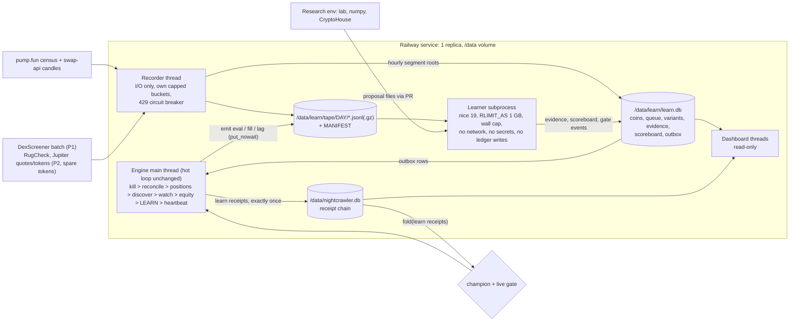
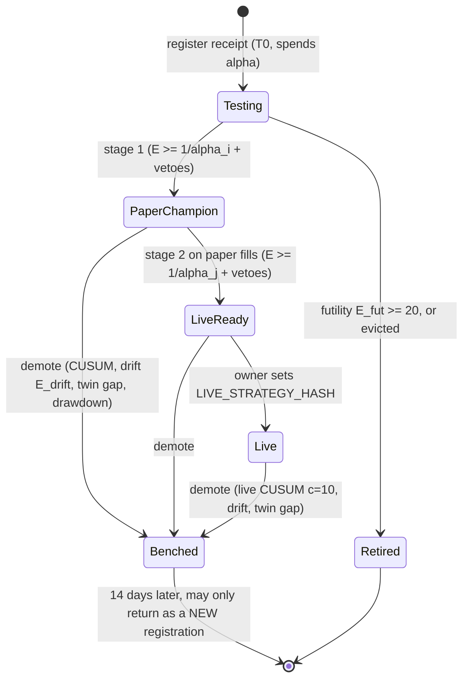

# nightcrawler learning loop: final spec

Chief architect's synthesis, written 2026-10-08. Accepted: this file is `docs/LEARNING.md`, and `docs/DESIGN.md` §13
"Learning" points to it.

> **Implementation status (phase 1 built and wired, 2026-10-08).**
>
> - **Core:** `src/nightcrawler/costs.py` (exact port of the lab model, `replay_model`, `cost_scale`,
>   `side_fill`; 50-case parity and the monotone-pessimism golden file), the optional `backtest.py` hooks
>   (`cost_fn`, `decide_at`, `entry_delay_s`, plus `entry_fn` for families such as the placebo; all default
>   `None` = unchanged results), `sources/pumpfun.py` `census_page(offset)` and `raw_candles(mint)`, and
>   `learn/{store,tape,recorder,variants,replay,evidence,card,gate}.py`, `learn/families/{dip_rebound,placebo}.py`,
>   `learn/seeds.json`. Tests: `test_costs_port`, `test_evidence`,
>   `test_learn_{tape,store,outbox,recorder,visibility,replay,variants,card,boundary}`.
> - **Integration:** `learn/job.py` (`nightcrawler learn run --incremental`: lease, seeds, judged days
>   replayed once with per-coin commits, scoreboard; spawned by the bot with nice 19, `RLIMIT_AS` 1 GB,
>   `RLIMIT_CPU`, a 600 s wall budget, no secrets, and an exit when its parent is gone), the engine's `learn`
>   stage (`engine.LearnStage`: outbox -> `learn` receipts exactly once over a 50 ms-lock connection,
>   learner spawned and reaped every `LEARN_INTERVAL_MIN`, recorder started after the boot receipt and
>   stopped at shutdown, SIGTERM forwarded to the learner; non-blocking `evals` / `fills` / `lag` rows),
>   `nightcrawler learn status [--json]` and `learn run`, `models.ReceiptKind` `"learn"`, the boot
>   receipt's `code_hashes` and `sim_hash`, `LEARN_ENABLED` / `LEARN_DISK_CAP_GB` / `LEARN_INTERVAL_MIN`, and
>   `learn.card.learning_card_state(settings, now)` filled from the scoreboard for the dashboard team's card
>   (`state`, `headline`, `variants` = top 3 + placebo with n / avg % / proof, `data` line). Tests:
>   `test_learn_job`, `test_engine` (learning on vs off trades identically; recorder, spawn, learner and
>   learn.db failures never change a tick), `test_cli` (`learn`), `test_learn_card`.
> - **Not in phase 1 (by plan):** the dashboard card itself (O6, built on `learning_card_state`), the janitor
>   (`LEARN_DISK_CAP_GB` is shown, not enforced: phase 3), the cadence estimate (decisions stay on the
>   180 s default), and everything of phases 2-4.
> - **Phase-1 choices made while building:** a day is replayed only once every coin of it is closed or
>   incomplete (so the 95 % completeness rule is known before any of its evidence exists); the replay prices a
>   coin at the SOL/USD of the newest census row fetched at or before the coin's creation (leak-free); the
>   recorder keeps the last 30 stored minutes per coin to detect revisions; a coin becomes `incomplete` only
>   when its last fetch is done, so its day is never sealed early; day D is replayed with `L_obs` from the
>   `lag` rows of the 7 days BEFORE D (all written before D began, so the replay stays a function of the
>   tape), and a replayed day is marked finished for the variants frozen before its newest coin, so it is
>   never read again until a new variant is frozen before its coins; the first learner run starts 60 s after
>   boot so the seeds are registered early; the engine's rows go into the coin's partition (or the UTC day of
>   the row for coins the recorder has not enrolled).
> - **Review fixes (phase 1):** the card reads aggregates only (never the coin, outbox or evidence rows) and
>   builds once per expiry; a seed the Settings put outside a hard range is skipped with its reason
>   (`learner.last_run.seeds_rejected`, the card's `warnings`, `learn status`) instead of failing every run;
>   a coin replayed under a new `sim_hash` keeps only the new outcome and the scoreboard scores only the
>   current simulator's evidence; a closed coin keeps one small row in learn.db (its candle mark lives in
>   `coin_marks` until it closes, its finished fetch rows are dropped, a finished day keeps one
>   `replayed_days` marker per version instead of a row per coin): about 1 KB per coin; no decision before a
>   coin's `first_seen_ts` (graduation, §4.2); candle fetches at +3/18/34/50 h so no hole can depend on how
>   busy a coin is (§3.1); a fetch still not done 48 h after it was due is given up (a host that refuses for
>   good no longer keeps days open) and a refusing host is shown on the card; raw files a crash left next to
>   a sealed day are deleted on the next pass; the learner PROCESS loads no broker, wallet, ledger, http,
>   requests or source client (checked by running it, `test_learn_boundary`).

**Inputs:**

- the three panel designs in `scratchpad/learning/`: `statistician.md`, `engineer.md` and `ml-researcher.md`, plus
  their simulations;
- `docs/DESIGN.md`;
- `src/nightcrawler/`: `engine`, `strategy`, `backtest`, `ledger`, `risk`, `dashboard`, `http`, `config` and `models`;
- `research/lab/`: `RESULTS.md`, `DATASET.md`, `costs.py` and `fetch.py`;
- PLAN.md §3.4-3.6 and §7-8.

---

## 0. In plain words

**What the owner asked for:** a bot that is "self-learning always, forever: the best self-learning system ever
created", shown on one simple page, and honest and safe enough for a real $100 later.

**What this builds:**

1. **It never stops learning.**
   - It records every pump.fun graduate as soon as it sees one, whether or not the bot trades it.
   - Every registered strategy version is traded "in the shadow" on all of those coins, at zero cost, around the
     clock.
   - Every night it searches for better versions and proposes the best few.
2. **It cannot fool itself.**
   - A version counts as proven only when it keeps winning, by more than luck can explain, on coins that did not exist
     when it was frozen.
   - Proof spends from a lifetime error budget, so testing ideas forever does not mean eventually promoting a lucky
     one.
3. **It cannot hurt the owner.**
   - Learning can switch real money **off** by itself. It can never switch it **on**.
   - Risk limits, the kill switch and the rug filter are out of its reach.
4. **The owner sees it as one card on the existing page.**

**What "best" honestly means:**

- The lab tested about 2,800 versions, and none beat costs. For weeks or months, the screen will most likely say
  **"Holding cash: nothing has proven an edge yet."** That is the system working.
- A real edge of +5% per trade would be proven on paper in about 1-2 months.
- An edge below about 3% per trade cannot be proven at this trade rate by any honest method.

---

## 1. Panel scores and verdict

Scores run from 1 to 5. Higher is better. For implementation risk, 5 means the lowest risk.

| Criterion | Statistician | Engineer | ML researcher |
|---|---|---|---|
| Protection against false promotion | **5** | 4 | **5** |
| Honesty of evaluation | **5** | **5** | **5** |
| Simplicity and robustness on Railway | 3 | **5** | 2 |
| Fit with the existing code | 3 | **5** | 3 |
| Data value over time | 4 | 3 | **5** |
| Owner experience (simple one-page view) | **5** | 4 | 4 |
| Implementation risk | 3 | **4** | 2 |
| **Total (out of 35)** | 28 | **30** | 26 |

**Why each design scored as it did:**

- **Statistician.**
  - **Strengths:** the strongest error control. A fixed-λ betting e-process, simulated on real lab returns, has a
    0.23-0.31% false-promotion rate at a 0.5% bound. It adds an alpha ledger and a lifetime 1% budget for real money.
    Every check except the e-process can only veto. It also has the clearest owner wording.
  - **Weaknesses:**
    - The real-time shadow book polls prices every 10 s and snapshots every candidate. On census-wide data that
      cannot run candle families, which includes today's strategy.
    - Process layout and crash safety are thin.
- **Engineer.**
  - **Strengths:**
    - The fewest moving parts.
    - A replay of the existing pure `strategy.py` through the existing `backtest.py`.
    - An outbox to the receipt chain that delivers exactly once, and a champion taken only from the chain.
    - Four realism auditors.
    - Rate-limit isolation, measured CPU and disk costs, and crash-safe tape files.
  - **Weaknesses:**
    - The paper bar of E ≥ 20 is weak.
    - The real-money bar uses replay evidence, not real-quote fills, and controls only "5% per year".
    - Fields that cannot be recovered later (snapshots, safety data) are pushed to phase 4.
- **ML researcher.**
  - **Strengths:** the best data thinking:
    - log raw current-state fields from day one;
    - stamp every datum with a `visible_at` time;
    - share one cost, fill and feature definition between the lab and live;
    - register procedures rather than fitted models;
    - check the pipeline with placebo and planted-edge controls.
  - **Weaknesses:** far more than three days of work. A nightly CryptoHouse pull with an unmeasured per-IP quota, a
    feature registry, PBO and a family bandit add many moving parts.

**Verdict.** The **engineer's architecture wins**. The **statistician's statistics replace the engineer's
thresholds**, and the **ML researcher's data discipline is adopted wherever it is cheap now**. The rest of the ML
design is scheduled for phase 4.

**Taken from each panelist:**

| From | Adopted |
|---|---|
| Engineer | One service and one volume: an engine `learn` stage, a recorder thread and a learner subprocess. The forward **tape** (census, candles at fixed ages, the engine's own observations). Shadow trading as a **replay** of frozen variants through `strategy.py` and `backtest.py`. The outbox, giving exactly-once receipts. The champion as a function of the receipt chain. Realism auditors (placebo, decision fidelity, twin fills, quote ratchet). Crash safety and storage cap. `LIVE_STRATEGY_HASH` |
| Statistician | The fixed-λ mixture e-process. The alpha ledger: α = 0.005 per registration, at most 4 registrations per ISO week, and a lifetime α of 1% for real money. One gate grants and every other check only vetoes. Stage 2 on **fresh paper-broker fills** (real quotes). The CUSUM formula, the futility and drift e-processes and the cool-downs. Missing data after entry is a loss. The card wording |
| ML researcher | A census-wide snapshot ladder of raw current-state fields from phase 1. `visible_at` and `label_ready_ts` rules. One shared `costs.py`. Monotone pessimism. The placebo screening pass rate. "Register procedures, not fits" (phase 4). The live-capability rule. Live probation at minimum size |
| Rejected | The engineer's E ≥ 20 paper bar and E ≥ 520 replay-based live bar. The statistician's real-time 10 s shadow of all candidates. The ML researcher's CryptoHouse tape, feature registry, PBO and bandit in the 3-day build (moved to phase 4) |

---

## 2. Architecture





**Seam invariants.** Each one has a test (§11).

| # | Invariant |
|---|---|
| S1 | **Trading never waits for learning.** Engine emits use `queue.put_nowait`; a full queue drops the item and counts it. In phase 1 the recorder uses its **own** `HttpClient`, built in `build_app`, with caps below every host's spare capacity. From phase 2, calls on hosts shared with trading go through `try_acquire(host, keep=1)` and are skipped when no spare token is left |
| S2 | **Only the engine writes receipts.** Learner results go to the `outbox` table. The engine's `learn` stage appends each row as a `learn` receipt with `outbox_id` in the payload. It checks `ledger.last_receipt("learn", where={"outbox_id": id})` first, so each row is receipted exactly once across crashes |
| S3 | **The champion is a pure fold over `learn` receipts.** Editing `learn.db`, kv or files cannot change what the engine trades. Before receipting a `promote` or `live_ready` event, the engine re-checks it with the pure `champion.check_event` (thresholds equal code constants, log E ≥ log threshold, registration precedes evidence, no freeze, cool-down respected). A failure is receipted as `event_rejected`, raises an alarm and has no effect |
| S4 | **The learner is a pure function of (tape bytes, code, constants).** It never imports `broker`, `wallet`, `risk`, `judge`, `http` or `sources` (AST test). It runs with a scrubbed environment and no secrets. The learner process, run for real, loads no `broker`, `wallet`, `judge`, `ledger`, `http`, `requests` or source client; it loads `risk` only for the backtester's pure sizing function (shared with live trading on purpose) and `sources._parse` (pure parsing helpers) |
| S5 | **Every crash is local.** A dead recorder is restarted with backoff. A dead learner leaves per-coin commits and resumes. On low disk, learning writes pause first. Trading never stops because of learning |
| S6 | **One learner at a time.** A lease row in `learn.db` holds pid and timestamp, and a stale lease is taken over. The service runs one replica (`railway.json`) |
| S7 | **Learning reads Settings and never writes them.** A spec has no risk fields. The live gate can only *block* entries. Exits and `sell_all` are never blocked |

**Why a subprocess.** Replay is CPU-bound pure Python. In a thread it would hold the GIL and could delay a stop-loss.

- **Spawn and stop.** The engine spawns `nightcrawler learn run --incremental` every 30 min, and `--nightly` at
  03:17 UTC (phase 3). On SIGTERM it forwards the signal.
- **Exit discipline.** The child commits after every coin and exits within about 2 s, inside the 30 s Railway drain.
  It also exits if its parent pid changes.

**Why not a separate Railway service.** A Railway volume mounts on one service only, so a cron service could not read
the tape.

---

## 3. Data model

### 3.1 The tape: forward capture, phase 1 onward

The tape is append-only JSONL, partitioned by the UTC day a coin was **first seen**: `/data/learn/tape/YYYY-MM-DD/`.

- **Common fields.** Every row carries `v` (schema version), `ts`, `mint` and, per source,
  `src: {name: [fetched_ts, http_status]}`.
- **Raw fields.** Current-state source fields are stored **raw**, not only as derived features. Features change over
  time; a raw field logged at time t can be re-featurized forever.

| Stream | Writer | When | Contents | Calls | Phase |
|---|---|---|---|---|---|
| `universe` | recorder | Census `frontend-api-v3.pump.fun/coins` (graduated, newest by creation) at offsets 0/70/140 every 5 min, plus a full sweep (offsets 0-980) every 6 h for late graduates | The census row as seen: immutable launch fields, and state fields stamped with `fetched_ts`. `first_seen_ts`, `late` flag | ~0.7/min, own bucket | 1 |
| `candles` | recorder | Fetch queue: each coin at `first_seen + 3 h, 18 h, 34 h, 50 h`; the last fetch closes the coin. The API serves the newest 1,000 **traded** minutes, so fetches are less than 1,000 minutes apart: a coin that keeps trading is covered as long as a quiet one (a hole would cut exactly the busiest coins' late candles) | `swap-api.pump.fun/v1/coins/{mint}/candles?interval=1m&limit=1000`, keeping only minutes not stored before. A **changed** closed minute is stored as a revision and counted. The **first** value is the one used | ~3.3/min average, own bucket capped at 6/min | 1 |
| `snaps` | recorder | Each coin at fixed ages since `first_seen`: {5, 15, 30, 60, 120, 240, 360} min. Coins due within the same 60 s are batched, 30 mints per call | Raw DexScreener pair: price, mcap, liquidity, txns and volume m5/h1, priceChange, boosts and orders | ≤ 1.5/min, own cap 4/min | 1 |
| `evals` | engine `_evaluate` | Every candle evaluation (≤ 3/min) and every `reject_*` / `enter` decision | ts, mint, `variant_hash`, newest closed candle ts, signal kind, reason, metrics, the snapshot used, cocoon pass and rule ids (already in `ledger.safety`), judge verdict | 0 | 1 |
| `fills` | engine `on_fill` | Every paper or live fill | Fill mirror, plus `variant_hash`, decision ts, quote out vs filled, impact | 0 | 1 |
| `lag` | engine | Every GT candle fetch and every equity tick | GT lag (= fetch ts − (newest closed candle ts + 60)), per-coin interval since its last evaluation, SOL/USD | 0 | 1 |
| `safety` | recorder | Each coin at `first_seen` + 5 min (retried at + 10 min if "not ready") and + 30 min | Raw RugCheck report (score, risks[], top holders, insider flags). Jupiter tokens v2: `organicScore`, label, `holderCount`, `numNetBuyers`, audit fields (batched if `lite-api` accepts a comma list; verify with one call) | RugCheck ~1.7/min, Jupiter ~0.3/min, both via `try_acquire` | 2 |
| `quotes` | recorder | 2 probes/min on a **uniformly random** enrolled coin at a random ladder age (never one a strategy chose) | Ultra `/order`, $20 buy plus a sell of the quoted tokens: in/out, `feeBps`, `priceImpactPct`, route, `quote_ts − request_ts`, and the cost model's prediction for the same trade | ≤ 4/min Jupiter via `try_acquire` | 2 |

**Fixed schedules.** Every coin gets the same schedule. No fetch ever depends on how a coin is doing, because
skipping "dead" coins would be an outcome-dependent choice.

### 3.2 Visibility rules (leak-free by construction)

The learner reads the tape only through `TapeView(mint, as_of=t)`, which applies these rules:

| Data | Visible from | Notes |
|---|---|---|
| Candles (event-time) | `m + 60 + L_obs` | `L_obs` = p75 of `lag.gt_lag` once ≥ 500 samples exist; default 60 s until then. A later fetch never moves this time |
| State rows (`universe` state fields, `snaps`, `safety`, `quotes`) | their `fetched_ts` | A row fetched after t is invisible at t |
| Labels (phase 3) | `label_ready_ts = t + L + h + 10 min` | Read only through `labels.asof(cutoff)` |
| Census launch fields (creator, name, symbol, flags, `created_ts`) | `created_ts` | Immutable at creation |

### 3.3 `learn.db` (SQLite WAL, `/data/learn/learn.db`; advisory, never authoritative for the champion)

| Table | Key columns |
|---|---|
| `coins` | mint PK, created_ts, first_seen_ts, day, pool, quote_mint, mayhem, launch JSON, status (`open` / `closed` / `incomplete`), fetches_done. Written once; it never grows |
| `coin_marks` | mint PK, mark JSON: the recorder's candle state (last 30 raw minutes) of an **open** coin; deleted when it closes |
| `fetch_queue` | (mint, kind, due_ts) PK, attempts, done_ts. Resumes exactly after a restart; 5 retries with backoff, then `incomplete`; a fetch not done 48 h after it was due is given up. When the coin closes its finished rows are dropped (given-up rows stay) |
| `replayed`, `replayed_days` | (variant_hash, mint) while a version is still being replayed on a day; then one (variant_hash, day, sim_hash) marker |
| `variants` | hash PK, family, params JSON, procedure JSON NULL, source (`seed` / `search` / `proposal`), register_seq, t0, alpha, threshold, promotable, status. A cache of `register` receipts |
| `evidence` | (variant_hash, mint, pricing) PK. Fields: entry_ts, exit_ts, `x` (net return, clipped to [−1, 1]), `x_raw`, `x_stress` (costs × 1.5), gross, cost, `sim_hash`, `cost_scale_ver`. `pricing` is `replay` or `paper` |
| `scoreboard` | (day, variant_hash) PK. Fields: n, Σx, Σx², log_e, log_e_fut, log_e_drift, lb, cusum, status, proof, eta_days |
| `outbox` | id PK, event, payload JSON, created_ts, receipt_seq NULL |
| `calibration` | tier, cost_scale, n, updated_ts (phase 2) |
| `trials` | day, family, n_candidates (search trial counter). Starts at 2,800 for the lab's history |
| `lease`, `meta` | learner lease; `user_version` migrations |
| `labels` | (row_id, horizon) PK. Fields: fwd_ret, max, min, rugged, label_version, label_ready_ts (phase 3) |

### 3.4 Storage and retention (5 GB volume shared with the ledger)

| Stream | Stored per day (gz, sealed) |
|---|---|
| candles (~1,200 coins × 3 fetches, minutes deduplicated) | ~6.5 MB |
| snaps (~8,400 rows) | ~1.3 MB |
| universe | ~0.4 MB |
| evals + fills + lag | ~0.9 MB |
| safety + quotes (phase 2) | ~0.9 MB |
| learn.db growth (measured: ~1 KB per closed coin) | ~1.2 MB |
| **Total** | **~11-12 MB/day ≈ 0.35 GB/month** |

- **Cap.** `LEARN_DISK_CAP_GB = 3.0` (about 9-10 months of data).
- **Janitor.** It deletes the oldest **sealed** partitions above the cap, by age only, and never touches an open
  partition. The cap counts learn.db too, and the janitor deletes the learn.db rows (coins, given-up fetches,
  `replayed_days`) of the partitions it deletes. Each deletion is receipted (`janitor_delete`, with the partition root). The hashes stay in the chain, so
  an exported copy remains verifiable.
- **Low disk.** If free space on `/data` falls below 1 GB, every learning write pauses. The ledger always has
  priority.
- **Export.** `nightcrawler learn export --since D` lets the research environment pull sealed partitions, weekly by
  default.

### 3.5 Crash safety

- **Writes.** Append, then `fsync` every 5 s or every 100 lines.
- **Torn lines.** A torn last line is cut at the last newline when the file is opened, and counted.
- **Sealing** happens when the day's coins are all closed (about D+3 00:30 UTC). The steps are: write
  `X.jsonl.gz.tmp`, fsync, rename, write a `MANIFEST.json` (sha256 per file plus a root), write the `tape_seal`
  outbox row, then delete the `.jsonl`. Every step is idempotent.
- **Hourly root.** Every hour the recorder hashes the byte ranges appended since the last root and writes a
  `tape_root` outbox row. Bytes cannot be edited afterwards without breaking a receipted root.
- **Day completeness.** A day where fewer than 95% of coins completed all fetches is **excluded for every variant**.
  The rule is fixed before any result exists.

---

## 4. Shadow book (zero-capital trading of many variants)

### 4.1 Why replay and not live shadowing

- **The live engine sees almost nothing of the market.** It fetches GeckoTerminal candles for at most 3 watched coins
  a minute, chosen by its own strategy. The market is about 1,200 graduates a day.
- **Live shadowing is too expensive and biased.** Shadowing every variant live on every coin would need about 100
  times the GT budget. Restricting variants to the engine's coins would judge them on the champion's picks.
- **A replay is just as out-of-sample.** Variants are pure functions of closed candles (the `strategy.py` contract),
  and each variant's hash is receipted before the coin is created. Replaying it later on the sealed, hashed tape is
  therefore as out-of-sample as running it live.
- **Live adds two things, and both are measured.** Real observation lag and real fills are fed back by the auditors
  (§4.4).
- **Results arrive 3-12 h after the market moves.** Learning decisions take weeks, so that delay costs nothing.

### 4.2 Replay rules

`learn/replay.py` runs `backtest.Backtester` on `TapeView` candles, using three new optional hooks in `backtest.py`.
All three default to `None`, so existing behaviour and tests are unchanged.

| Effect | Rule | Source |
|---|---|---|
| Observation lag | A minute is visible at `m + 60 + L_obs` | `lag` stream (p75); default 60 s |
| Evaluation cadence (hook `decide_at`) | Decisions only at `t0 + k·C + phase(mint)`, where `phase = int(sha256(mint)) mod C` | Median per-coin interval from the `lag` stream; default 180 s |
| Entry fill (hook `entry_delay_s`) | `max(open of the candle containing t_dec + L_obs + L_land, close at decision)` | `L_land` = 5 s until live data exists |
| Exit fill | `backtest.py`'s pessimistic intrabar order: stop before take-profit, stop at `min(level, close)`, gaps at the open | Unchanged |
| Costs (hook `cost_fn`) | `src/nightcrawler/costs.py`, a port of `research/lab/costs.py`: pump.fun fee tier at that mcap, constant-product impact from `K_GRAD`, Ultra 10 bps, network fee. The MEV buffer is replaced by `PAPER_SLIPPAGE_BPS` (100 bps) per side, mirroring the paper broker. Everything is multiplied by `cost_scale[tier]` (≥ 1.0, a ratchet; §4.4) | Lab model, calibrated to Ultra quotes within 0.07 pp |
| Impact cap | No entry if the model impact exceeds `MAX_PRICE_IMPACT_PCT` | Settings |
| Missing data after entry | If the tape is incomplete after an entry, the trade exits at **entry × 0.5** at its time stop | Statistician P10 |
| Pending | A trade whose exit is beyond fetch coverage stays **pending**. It is never dropped and never counted early | — |
| Universe | Launch-time filter (SOL-quoted, not Mayhem), the variant's own age, mcap and liquidity filters, then the variant's signal. The cocoon applies "as of" its time only once phase-2 `safety` rows exist; until then its absence is measured by the twin gap | — |
| Graduation | No decision before the coin's `first_seen_ts`, when the recorder first saw it in the **graduated** census (it graduated at or before then). Buying earlier, on the bonding curve, would use the future fact that it graduates | `research/lab`: no entries before graduation |

### 4.3 The evidence unit and the forward-only rule

- **One observation per (variant, coin).** It is the net return of the **first** $20 trade:
  `x_raw = proceeds/stake − 1`. Re-entries are kept for the portfolio view but are not evidence.
- **The test value** is `x = clip(x_raw, −1, +1)`. Clipping the upside is conservative for "mean > 0" and stops one
  lottery winner from proving an edge.
- **Forward-only rule.** A coin counts for variant V only if `coin.created_ts > V.t0`, where `t0` is the timestamp of
  V's `register` receipt. Everything about such a coin happened after V was frozen. The rule is applied at every
  stage, in phase 1 as well. **Phase-1 evidence therefore counts in phase 2**, because α and the threshold are written
  into the `register` receipt.
- **Order** is `(exit_ts, mint)`. The fixed-λ e-process is a product, so the order in which outcomes arrive cannot be
  gamed.

### 4.4 Auditors: the simulator checks itself

| Auditor | Measures | Action | Phase |
|---|---|---|---|
| **Placebo must lose** | Family `placebo`, never promotable and spending no α. Entry at the first minute after a hash-chosen offset in `[g + min_age, g + min_age + 6 h]` where the benchmark's universe check passes; benchmark exits. Lab reference: −6.4% per trade | Mean of its last 300 trades > −1% → **freeze promotions** and alarm | 1 (shown), 2 (enforced) |
| **Quote calibration** | Random `quotes` probes: quoted round-trip loss ÷ model loss, per mcap tier, over 7 days with ≥ 200 samples | `cost_scale[tier] = max(current, UCB95 of the ratio)`. It only rises automatically. A rise is receipted (`calibration`) and all affected evidence is recomputed from the tape. Lowering it needs a PR | 2 |
| **Twin fill gap** | For each paper fill: the paper net return minus the replay net return for the same variant, coin and decision minute | Feeds the ratchet. Champion median over its last 20 twins < −2.0 pp → **demote** (a realism failure) | 2 |
| **Decision fidelity** | Each live `evals` row replayed with `entry_signal` on `TapeView(as_of=ts)`; agreement of the signal kinds | < 95% over 24 h (with ≥ 50 evals) → **freeze promotions**. This catches GT vs swap-api differences, data revisions and lag errors | 2 |
| **Simulator change** | `sim_hash` = sha256 of the bytes of `replay.py`, `costs.py` and `backtest.py` | A change is receipted, all evidence is recomputed (a coin that no longer trades loses its old row; the scoreboard scores only evidence of the current `sim_hash`), and promotions **freeze for 7 days**. A golden test refuses any cost change that lowers modelled costs (monotone pessimism) | 1 |

---

## 5. Statistics: exact rules and default thresholds

All constants live in `learn/gate.py` as **code constants**, not environment variables. Changing one takes a PR, a new
`sim_hash` and a 7-day freeze. `learn/evidence.py` is pure and uses the standard library only.

### 5.1 The e-processes

```python
LAMBDAS = (0.05, 0.10, 0.20, 0.35, 0.50, 0.70)   # fixed forever (inside sim_hash)

def step_up(logw, x, m=0.0):        # H0: E[x] <= m      (promotion; m = 0)
    return [w + log1p(l / (1 + m) * (x - m)) for w, l in zip(logw, LAMBDAS)]

def step_down(logw, x, m):          # H0: E[x] >= m      (futility m=+0.02; drift m=0)
    return [w + log1p(l / (1 - m) * (m - x)) for w, l in zip(logw, LAMBDAS)]

def step_paired(logw, d):           # H0: E[d] <= 0, d = x_A - x_B in [-2, 2]
    return [w + log1p(l / 2 * d) for w, l in zip(logw, LAMBDAS)]

log_e = logmeanexp(logw)            # an e-value; P(sup_t E_t >= 1/alpha) <= alpha (Ville)
```

**Derived values** (dashboard and sizing only; neither grants anything):

- **Always-valid lower bound:** `LB_t(α) = inf{m ∈ [−1, 1] : E_t(m) < 1/α}`. It is found by bisection, since E_t(m)
  falls as m rises, and the running maximum is kept.
- **Proof:** `proof = clip(log E / log threshold, 0, 1)`.
- **ETA in trades:** `max(0, log thr − log E) / (μ̂² / 2σ̂²)`, shown only when μ̂ > 0. Dividing by trades per day over
  the last 7 days gives days.

### 5.2 The alpha ledger (a fold over `register` and `live_ready` receipts)

| Budget | Rule | Guarantee |
|---|---|---|
| Paper | Each registered variant gets α_i = 0.005, so it needs **E ≥ 200**. At most **4 registrations per ISO week** (seeds, nightly search and research proposals combined; unused allowance does not roll over). At most **24 active**. Controls (placebo) are exempt because they can never be promoted | At most ~1.04 expected false paper promotions a year, even if every idea is worthless; valid under any dependence between variants |
| Real money | The j-th stage-2 attempt in the bot's lifetime gets α_j = 0.01 / (j(j+1)), so thresholds run **200, 600, 1,200, 2,000, …** | Lifetime probability of any false real-money promotion ≤ **1%** |

Re-registering a benched or retired spec, or a near neighbour of one, is a new registration. It spends new α and starts
again at E = 1.

### 5.3 Stage 1: paper champion

**Grant:** `E ≥ 1/α_i` on the variant's `replay` evidence since `t0`.

**Vetoes**, all of which must pass:

1. n ≥ 100 (that is, ≥ 100 distinct coins).
2. ≥ 7 calendar days since `t0`, and ≥ 5 UTC days with ≥ 5 trades each.
3. The mean stays > 0 with `x_stress` (costs × 1.5).
4. The mean stays > 0 without the top 2 trades.
5. No cluster supplies > 30% of trades or of profit. A cluster is the same creator, or the same normalized symbol
   ("ticker family"). Funder and operator clusters are added in phase 4.
6. The mean is > 0 in both halves of the record.
7. If a champion exists: the paired e-process against it reaches ≥ 20, on coins after the later of the two `t0`s.
8. Engine-executable family (`dip_rebound` in v1) and `promotable = true`.
9. ≥ 7 days since the last promotion.
10. No global freeze is active (§5.7).

### 5.4 Stage 2: ready for real money (fresh evidence on real quotes)

**Grant:** a **new** e-process, started at the `promote` receipt, on the champion's **paper-broker fills**
(`pricing = paper`: live Ultra quotes minus the 100 bps haircut). It must reach `E ≥ 1/α_j`.

**Vetoes:**

- n ≥ 150 paper trades over ≥ 14 days;
- every stage-1 veto, applied to these trades;
- median twin gap ≥ −1.0 pp;
- no CUSUM or drift alarm since promotion.

**On a pass:** a `live_ready` receipt is written. The dashboard shows "Ready for your OK". Nothing else changes until
the owner acts (§7).

### 5.5 Decay detection and demotion (fast)

| Trigger | Rule | Applies to |
|---|---|---|
| CUSUM | `S_t = max(0, S_{t−1} + (−0.01 − x_t))` on the champion's replay evidence, in order. Alarm when `S_t > c·σ̂`, where σ̂ = sd of its stage-1 `x`, frozen in the `promote` receipt. **c = 14** (paper champion), **c = 10** (live). At σ̂ = 0.22: a flip from +4% to −6% is caught in a median 52 trades (p90 95); the false-alarm rate within 500 trades at +4% is 5.4% | champion (replay evidence); c = 10 once live |
| Slow drift | `step_down` with m = 0 on trades since promotion; **E″ ≥ 20** | champion |
| Realism | Median twin gap over the last 20 < −2.0 pp | champion |
| Drawdown | The variant's own $100 replay equity, or its paper equity, falls more than 35% from peak (inside the 50% risk halt) | champion |
| Code | `variant_hash` no longer matches the code (`strategy.py` or the family file changed) → `champion_invalidated` | champion |

**Effect of a demotion.** It is immediate and automatic:

- `demote` receipt, then the variant is benched for 14 days, then CASH.
- `live_revoked` if the variant was live. Live entries stop at once; exits continue.

### 5.6 Retirement (futility) and eviction

- **Futility.** Retire a testing variant when `step_down` with m = +0.02 reaches **E′ ≥ 20**: the variant can no
  longer plausibly beat +2% per trade. In simulation:

  | True edge per trade | Result |
  |---|---|
  | −6% | Retired after a median of 93 trades |
  | 0% | Retired after about 640 trades |
  | +2% exactly | Retired 4% of the time |
  | +5% | Never retired |

- **Eviction.** When all 24 slots are full, the variant ≥ 14 days old with the lowest log E is evicted. The champion
  and the placebo are never evicted.

### 5.7 Global freezes (stop promotions; demotions still act)

A promotion freeze is triggered by any of:

- placebo optimism (§4.4);
- decision fidelity below 95%;
- a `sim_hash` change in the last 7 days;
- no successful learner run for 48 h;
- cost calibration stale: fewer than 200 quote probes in the last 7 days (phase 2 onward), so costs are unverified;
- the nightly placebo **screening** pass rate above 10% over 28 days (phase 3).

During a freeze, the incumbent keeps trading paper under unchanged risk limits.

### 5.8 Cool-downs

| Event | Cool-down |
|---|---|
| Promotion | ≥ 7 days before the next promotion. Demotions are never delayed |
| Demotion or retirement | Benched for 14 days; it can return only as a new registration |
| ≥ 3 demotions or retirements in one family within 30 days | The family is frozen for 30 days |
| Champion change | Live entries are disarmed automatically. Re-arming needs a new stage 2 and the owner again |

### 5.9 Constants (`learn/gate.py`)

```python
PAPER_ALPHA = 0.005; REG_PER_ISO_WEEK = 4; MAX_ACTIVE = 24
LIVE_ALPHA_TOTAL = 0.01                       # alpha_j = 0.01 / (j * (j + 1))
S1_MIN_N = 100; S1_MIN_DAYS = 7; S1_ACTIVE_DAYS = 5; S1_ACTIVE_DAY_TRADES = 5
COST_STRESS = 1.5; CLUSTER_MAX_SHARE = 0.30; PAIRED_E = 20.0
S2_MIN_N = 150; S2_MIN_DAYS = 14; S2_MIN_TWIN_GAP_PP = -1.0
FUTILITY_M = 0.02; FUTILITY_E = 20.0; DRIFT_E = 20.0
CUSUM_REF = -0.01; CUSUM_C_PAPER = 14.0; CUSUM_C_LIVE = 10.0
TWIN_DEMOTE_PP = -2.0; TWIN_WINDOW = 20; VARIANT_DD_DEMOTE = 0.35
PROMOTION_SPACING_D = 7; BENCH_D = 14; FAMILY_FREEZE = (3, 30, 30)   # n, window d, freeze d
PLACEBO_MAX_MEAN = -0.01; PLACEBO_WINDOW = 300
FIDELITY_MIN = 0.95; FIDELITY_MIN_EVALS = 50; COMPLETENESS_MIN = 0.95
SIM_CHANGE_FREEZE_D = 7; LEARNER_STALE_H = 48
LIVE_PROBATION_TRADES = 50                    # at MIN_POSITION_USD
```

### 5.10 What to expect (statistician's simulations on real lab returns)

The table gives the median number of trades to reach E ≥ 200, with the 90th percentile in brackets.

| True edge per trade, net | sd 0.22 | sd 0.48 |
|---|---|---|
| +3% | 630 (1,146) | 2,714 (> 5,000) |
| +5% | 283 (466) | 932 (1,858) |
| +8% | 155 (216) | 350 (676) |

- **Shadow trade rate.** Today's dip-rebound fired once on the lab's 172 test coins. That suggests roughly 7 shadow
  trades a day census-wide, a rough figure from one sample. At that rate a +5% edge would reach paper champion in
  about 6 weeks.
- **Stage 2 is slower.** It needs about the same number of **paper** trades, and the engine can only trade coins it
  watches. Expect months.
- **That is deliberate.** If paper throughput is the bottleneck, the fix is engine throughput (§12, items 1 and 3),
  not a lower bar.
- **The zero-edge case.** A strategy with zero edge crossed E ≥ 200 in 0.23-0.31% of 8,000 simulated streams.
  Checking PLAN PT1's daily CI rule the same way gave 12-16%.

---

## 6. Nightly research: retraining forever (phase 3)

**Where it runs.** In the learner subprocess, on the same service:

- `nightcrawler learn run --nightly` at 03:17 UTC, with a **15 CPU-minute budget**;
- anytime and checkpointed after each candidate;
- seeded with `sha256(date)`.

The research environment (numpy, CryptoHouse, the lab) does the heavy work and sends results as **proposal files** via
PR: `strategies/proposals/<hash>.json`, holding the spec, the screening table, the trial count and data provenance.
They are registered at boot and draw on the same weekly allowance; when the allowance is used up they wait in a queue.

**Steps:**

1. Verify the segment hashes of the sealed partitions. Build the labels that are ready.
2. Recompute **all** evidence from scratch and compare it with the incremental values. A mismatch freezes promotions
   and raises an alarm.
3. Run the auditors: twin gap, fidelity, the placebo check, and the `cost_scale` ratchet.
4. **Walk-forward search** over sealed partitions only:
   - **Splits.** TRAIN = 14 days, then a 1-day embargo, then VAL = the 4 newest sealed days. Coins are assigned whole
     to a split by `created_ts`.
   - **Candidates.**
     - 80% are local mutations of the top 3 variants per family: Gaussian steps in normalized parameter space, inside
       the bounds.
     - 20% are uniform draws within the bounds.
     - Every night also screens 5 **placebo candidates** (random entries, and hosts with labels shifted by +1 day).
   - **Admission bar.** Every one of these must hold:
     - VAL lower 80% bootstrap bound (by coin, 10,000 draws) > 0 with costs × 1.25;
     - n_val ≥ 30 from ≥ 20 coins;
     - TRAIN and VAL have the same sign;
     - the mean stays > 0 without the top 2 trades;
     - it beats the placebo on VAL by ≥ 3 pp;
     - **plateau**: the median of its 6 nearest grid neighbours on VAL is > 0.
   - **Output.** At most **2 proposals a night** within the weekly cap of 4. Each becomes a `register` receipt, which
     starts its forward evidence clock. The search's numbers are **never** evidence.
5. Update the trial counter and the placebo screening pass rate. Run the janitor. Write the `nightly_run` and
   `scoreboard` outbox rows.

**What learns automatically:**

- which registered variant is champion;
- parameters within families;
- simulator calibration (cost scale, `L_obs`, cadence);
- decay.

**What never learns automatically:**

- new code (families, features);
- risk limits;
- statistical constants;
- live arming.

**Search runtime.** About 40-80 s per candidate (18 days × ~1,200 coins), so roughly 11-22 candidates a night. That is
deliberately a small, local search.

---

## 7. Safety invariants and the real-money rule

**Learning can never change:**

- **Risk settings:** `POSITION_PCT`, `MIN_POSITION_USD`, `MAX_POSITION_USD`, `MAX_OPEN_POSITIONS`,
  `DAILY_LOSS_LIMIT_PCT`, `MAX_DRAWDOWN_HALT_PCT`, `MAX_WALLET_USD`, `SOL_RESERVE`, `MAX_PRICE_IMPACT_PCT`,
  `MAX_SLIPPAGE_PCT`, `QUOTE_MAX_AGE_S`, `EXIT_MAX_IMPACT_PCT` and `PAPER_SLIPPAGE_BPS`.
- **Controls:** the kill switch, halt and reset semantics, the cocoon's rules and fail-closed policy, radar exits,
  `TRADING_MODE`, `LIVE_CONFIRM`, the wallet, the receipt rules and the statistical constants.

**Enforcement:**

1. **The spec schema holds strategy parameters only, each with a hard range in code.**

   | Parameter | Hard range |
   |---|---|
   | `stop_loss_pct` | [0.05, 0.35] |
   | `max_hold_min` | [5, 360] |
   | `take_profit_pct` | [0.05, 3.0] |
   | `trail_pct` | [0.05, 0.5] |
   | `dip_pct` | [0.2, 0.9] |
   | `confirm_green` | 1-4 |
   | `min_buy_sell_ratio` | [0.5, 3] |
   | `dip_lookback_h` | [0.5, 12] |

   A stop and a time stop are mandatory.

   **Safety-related filters are anchored to Settings and may only tighten:**

   - `min_age_min` ≥ Settings;
   - `max_age_h` ≤ Settings;
   - the mcap window stays inside the Settings window;
   - `min_liquidity_usd` ≥ Settings;
   - `cooldown_min` ≥ Settings.

   A spec that carries a risk key, or that is out of bounds, is refused at registration. Research-only specs that
   loosen an anchor can run in shadow with `promotable = false`, which measures what the filters are worth, but they
   can never become champion.
2. **Adoption is checked.** The engine validates the chain's champion against the schema and the anchors before
   adopting it. On a violation it refuses the spec, keeps CASH, writes a `champion_rejected` receipt and raises an
   alarm.
3. **Open positions keep the parameters they opened with.** `Position` gains `variant_hash` and `params`. A new
   champion affects **new entries only**.
4. **No champion means paper practice.** With no champion, paper trades the Settings strategy, labelled "practice
   (unproven)". Live trades nothing.

**Real money needs two keys.**

- **Key 1, automatic and on the chain:** a `live_ready` receipt from stage 2 (§5.4).
- **Key 2, the owner:** in Railway variables, set `TRADING_MODE=live`, set `LIVE_CONFIRM`, and set the new
  `LIVE_STRATEGY_HASH` to the 12-hex prefix the dashboard shows. This is the same phone-friendly pattern as
  `RESET_HALT_TOKEN`.
- **Live entries require all of:**
  - live mode and the confirm phrase;
  - the hash equals the current champion's;
  - a `live_ready` receipt exists for it;
  - no `demote` or `live_revoked` receipt has followed it.

  Otherwise `_entries_blocked_why` returns `live_gate: <reason>`. Exits, stops and `sell_all` are **never** blocked.
- **Probation.** The first 50 live trades run at `MIN_POSITION_USD`, under the live CUSUM (c = 10).
  - **Any alarm:** `live_revoked`, then a demotion to paper.
  - **Going live again:** needs a new stage 2 at the next α_j, and the owner again.
- **There is no override.** No switch lets an unproven strategy trade real money. That would be a reviewed code
  change.

---

## 8. Receipts and provability

**Identity.**

- `variant_hash` is sha256 of `canonical_json({schema: 1, family, family_code_sha256, params, procedure})`.
  - `family_code_sha256` is the sha256 of the bytes of `strategy.py` plus `learn/families/<family>.py`.
  - `procedure` is null in v1. In phase 4 it holds the trainer code sha, the hyperparameters and the window rule;
    never the fitted weights.
- **The `boot` receipt** gains `code_hashes` {strategy, backtest, costs, learn} and `sim_hash`.
- **Every link to a version is recorded.** `enter` decisions, fills and Position rows carry `variant_hash`.

**New receipt kind `learn`.** `models.ReceiptKind` gains `"learn"`. The chain format is unchanged, so existing
verifiers keep working. Every payload holds `event` and `outbox_id`.

| Event | Payload | Phase |
|---|---|---|
| `register` | variant_hash, family, params, source (seed / search / proposal with commit), α, threshold, `t0` = receipt ts, trial count so far | 1 |
| `tape_root` (hourly) | hour, segments [{file, start, end, sha256}], root | 1 |
| `tape_seal` (daily) | day, files, root, completeness | 1 |
| `scoreboard` (daily) | per variant: n, Σx, Σx², log E, log E′, LB, CUSUM, status; `evidence_root` (Merkle root over the evidence rows); sim_hash; cost_scale | 1 |
| `promote` | stage, variant, log E, threshold, the value of every veto, σ̂, scoreboard seq | 2 |
| `demote` / `retire` / `bench` / `evict` | variant, the rule that fired, its statistics | 2 |
| `live_ready` / `live_revoked` / `live_toggle_seen` | variant, j, α_j, statistics; the observed `LIVE_STRATEGY_HASH` | 2 |
| `champion_adopted` / `champion_rejected` / `champion_invalidated` / `event_rejected` | written by the engine when it acts | 2 |
| `calibration` / `freeze` / `unfreeze` | old and new `cost_scale`, sample counts; which auditor | 2 |
| `nightly_run` / `janitor_delete` / `alias` | code version, seed, runtime, proposals, placebo pass rate; deleted roots; golden-replay alias (old → new hash, when decisions are byte-identical over 30 sealed days) | 3 |

**No silent promotion.** This holds by construction:

1. The champion and the live gate are a pure fold over `learn` receipts.
2. The gate is a pure function `step(state, scoreboard, now) → (state', events)`. Every state change is an event, and
   every event is a receipt before it takes effect.
3. The engine re-checks `promote` and `live_ready` payloads against the code constants before receipting them.
4. `nightcrawler learn verify [--day D]` rebuilds, from the exported tape and the code at the receipted hashes:
   evidence, scoreboards, e-values, CUSUMs, every threshold and every veto. It fails on any hash mismatch or on any
   promotion that does not recompute. The verifier is the learner's own code, so a third party with the export and
   the git commit gets the same numbers.
5. Publishing the head hash commits to the whole learning history as well as to the trades.

---

## 9. Dashboard: one card on the one page

The page stays a single, read-only, phone-first page with no new routes. Learning adds **one card**. Its details are
collapsed by default (`<details>`).

- **Data source.** `build_state` gains a `learning` key, read from the latest `scoreboard` row in `learn.db` (60 s
  cache) and the chain. There are no network calls.
- **Safety.** Every string goes through `scrub()` and is inserted with `textContent`.

```
LEARNING                                  ● always on · updated 12 min ago
Trading: CASH. No idea has proven an edge yet.
Paper is practising with the default strategy (unproven).

Ideas being tested: 9                trades   avg     proof
  dip 45%, stop 20%     #3fa1c2       212   +3.1%   ████░░░░ 48%  ~25 days
  dip 60%, tp 30%       #9c20aa        88   +0.9%   █░░░░░░░ 17%  months
  random entry (control)               402   -4.8%   losing, as it should

Data: 1,186 coins yesterday · 99% complete · costs checked OK
Last change: Oct 21 · dropped "dip 30%" (losing beyond bad luck)
Real money: OFF · needs proof on real quotes + your OK
▸ details
```

**Card rules:**

- **State line.** One of:
  - "Holding cash, nothing proven"
  - "Proven on paper: <name>"
  - "Ready for your OK: set LIVE_STRATEGY_HASH=<12 hex>"
  - "Live: <name> (probation 12/50)"

  A frozen state shows a red chip with one plain reason, e.g. "paused: the simulator looked too optimistic".
- **Rows.** The top 3 variants by proof, plus the placebo, which is always shown. A champion row shows "health" (CUSUM
  as a share of its alarm level) instead of a proof bar.
- **Wording.** Plain words, no statistics jargon on the card. "Proof" is `log E ÷ log threshold`. ETA is the formula
  in §5.1, shown as "~N days", "months" or "unlikely".
- **Details** (expanded):
  - every variant with status and hash;
  - the last 10 learning events, each with its receipt seq;
  - cost model vs quotes per tier;
  - fidelity;
  - disk use against the cap;
  - the lifetime α spent;
  - the trial counter.

**`/api/state.learning`.** All keys are always present; unknown values are null.

```json
{"state": "cash|paper_champion|live_ready|live", "frozen": null, "updated_at": 0.0,
 "paper_variant": {"name": "", "hash12": "", "label": "practice|proven"},
 "champion": {"name": "", "hash12": "", "n": 0, "mean_pct": 0.0, "lb_pct": 0.0, "health": 0.0, "since": 0.0},
 "top": [{"name": "", "hash12": "", "n": 0, "mean_pct": 0.0, "proof": 0.0, "eta_days": null, "status": ""}],
 "placebo": {"n": 0, "mean_pct": 0.0, "ok": true},
 "data": {"coins_yesterday": 0, "completeness_pct": 0.0, "cost_gap_pp": null, "fidelity_pct": null,
          "disk_gb": 0.0, "cap_gb": 3.0},
 "events": [{"ts": 0.0, "text": "", "seq": 0}],
 "budget": {"registrations_this_week": 0, "live_attempts": 0, "trials_total": 2800},
 "live": {"ready": false, "armed": false, "why": ""}}
```

---

## 10. Budget

**API calls.** Learning stays at or under these rates.

| Host | Trading today | Learning | How |
|---|---|---|---|
| `frontend-api-v3.pump.fun` | 0 | census ~0.7/min | own bucket 12/min (P1) |
| `swap-api.pump.fun` | 0 | candles ~3.3/min, cap 6/min | own bucket (P1) |
| `api.dexscreener.com` (limit 60/min) | ~5/min | snaps ≤ 1.5/min, cap 4/min | own capped bucket (P1); `try_acquire` from P2 |
| `api.rugcheck.xyz` (1/s) | ≤ 10/min | ~1.7/min | `try_acquire(keep=1)` (P2) |
| Jupiter (1/s) | ~20-25/min | probes ≤ 4/min, tokens ~0.3/min | `try_acquire(keep=1)` (P2) |
| `api.geckoterminal.com` | ≤ 14/min | **0** | — |

**Circuit breaker.** A 429 or 403 on any learning host pauses learning on that host for 10 min. Trading is
unaffected.

**Railway cost.** Rates used: $20 per vCPU-month, $10 per GB-month of memory, $0.15 per GB-month of volume.

| Item | Estimate | Per month |
|---|---|---|
| Learner CPU | Incremental ~2-4 min/day + nightly 15 min ≈ 600 vCPU-min | ~$0.30 |
| Learner memory | ~300 MB × ~40 min/day | ~$0.10 |
| Recorder memory | ~15 MB constant | ~$0.15 |
| Volume | 3 GB learning cap | ~$0.45 |
| **Learning total** | | **≈ $1.00** |

The whole service (engine plus learning) then costs about $3-3.5 a month, inside the $5 plan. The engine's own CPU and
memory are unchanged.

---

## 11. Build plan

**Ownership.**

- **O7 learning (new owner):** `src/nightcrawler/learn/*` and `tests/test_learn_*.py`.
- **Contract changes through the integrator** (DESIGN.md §2 freezes these files):
  - `config.py`: P1 `LEARN_ENABLED` (default true) and `LEARN_DISK_CAP_GB` (3.0); P2 `LIVE_STRATEGY_HASH`;
  - `models.py`: P1 `ReceiptKind` gains `"learn"`; P2 `Position.variant_hash` and `Position.params`;
  - `http.py`: P2 `try_acquire(host, keep)` and `priority="low"`.
- **Existing owners:**
  - O1: `sources/pumpfun.py`;
  - O3: `costs.py` and the `backtest.py` hooks;
  - O6: `dashboard.py`;
  - integrator: `engine.py`, `cli.py` and the docs.

Every phase ends green on `pytest -q` (offline, FakeClock, FakeHttp).

### Phase 1 (≤ 1 day): forward logging, shadow book and scoreboard. Trading behaviour unchanged

| File | Owner | Work |
|---|---|---|
| `sources/pumpfun.py` | O1 | `census_page(offset)`, `candles(mint)`; fixtures from the lab's saved responses |
| `src/nightcrawler/costs.py` | O3 | Port of `research/lab/costs.py`, plus `cost_scale` and `paper_slippage_bps` |
| `backtest.py` | O3 | Optional hooks `cost_fn`, `decide_at`, `entry_delay_s` (all default `None`) |
| `learn/store.py` | O7 | `learn.db` schema and migrations, lease, outbox |
| `learn/tape.py` | O7 | `TapeWriter` (append, fsync, hourly segment roots, seal), `TapeReader` (torn-line repair), `TapeView(as_of)` |
| `learn/recorder.py` | O7 | `RecorderThread`: census, candle fetch queue, DexScreener snaps; own capped `HttpClient`; circuit breaker; restart with backoff |
| `learn/variants.py`, `learn/families/{dip_rebound,placebo}.py`, `learn/seeds.json` | O7 | `VariantSpec`, bounds and anchors, `variant_hash`. The seeds are the Settings benchmark plus 3 lab dip-rebound points, registered at first boot (4 = the week-1 allowance), plus the placebo |
| `learn/replay.py` | O7 | Replay over closed coins with the forward-only rule, first trade per coin, missing data as −50%, completeness exclusion |
| `learn/evidence.py` | O7 | The pure statistics of §5.1, CUSUM, LB, proof, ETA |
| `learn/job.py` | O7 | `learn run --incremental`: rlimits, nice, lease, parent-death check, per-coin commits, scoreboard, outbox |
| `engine.py` | integrator | Non-blocking emits (`evals`, `fills`, `lag`). A `learn` stage drains the outbox into receipts exactly once and spawns and reaps the learner every 30 min. Start and stop the recorder |
| `cli.py` | integrator | `nightcrawler learn status` and `learn run` |
| `dashboard.py` | O6 | Card v1: state line ("practice, promotions start in phase 2"), top 3 plus placebo with n, avg and proof, data line |

**Acceptance tests (phase 1):**

- `test_learn_tape`:
  - a torn line is repaired and counted;
  - the seal is atomic under a crash injected at each step;
  - each segment root matches its bytes;
  - on a revision, the first value wins.
- `test_learn_recorder`:
  - the fetch schedule is a function of `first_seen` only (outcome-independent);
  - recorder exceptions never stop `Engine.tick`;
  - a 429 opens the circuit breaker;
  - with `LEARN_ENABLED=false`, there are zero learning calls.
- `test_learn_visibility`:
  - **garbage after the cutoff**: for 200 random (coin, t) pairs, every candle with `m + 60 + L_obs > t` and every
    state row with `fetched_ts > t` is replaced by noise, and decisions do not change;
  - **prefix invariance**: a tape truncated at t gives identical decisions up to t.
- `test_learn_replay`:
  - **forward-only**: coins with `created_ts ≤ t0` never produce evidence;
  - one entry per coin;
  - deterministic: the same tape gives the same evidence rows and the same `evidence_root`;
  - missing data after entry gives −50%;
  - an incomplete day is excluded;
  - with the hooks off, the result equals `Backtester` on a fixture.
- `test_costs_port`: matches `research/lab/costs.py` on 50 cases to within 1e-9. A monotone-pessimism golden file
  fails if modelled costs drop.
- `test_evidence`, on a committed fixture of 500 real TRAIN/VAL returns, zero-centred:
  - **null**: over 400 streams × 1,500 trades, checked after every trade, crossings ≤ α + 3·SE;
  - **power**: a planted +8% edge reaches E ≥ 200 within 400 trades in ≥ 90% of runs;
  - order invariance;
  - LB coverage;
  - futility retires a −6% stream.
- `test_learn_outbox`: exactly once across a crash between append and mark.
- `test_learn_boundary` (AST):
  - learner modules import none of `broker`, `wallet`, `risk`, `judge`, `http` or `sources`;
  - the recorder imports only `http`, `sources` and `learn.{tape,store}`.
- `test_engine` additions:
  - with learning on, trading decisions on the `tests/world.py` scenario are identical to learning off;
  - a recorder or learner crash does not change the tick.
- `test_dashboard`: the `learning` key is always present; an empty state renders "collecting data, day 1"; strings
  are scrubbed.

**Cut order if short on time:** first the snaps stream, then the dashboard table (keep the state line). **Never cut:**
the forward-only rule, the hourly roots, or the leakage tests.

### Phase 2 (1 day): promotion and decay engine

| File | Owner | Work |
|---|---|---|
| `learn/gate.py` | O7 | Constants (§5.9). Pure `step()`: alpha ledger, stage-1 and stage-2 grant and vetoes, paired test, CUSUM, drift, twin and drawdown demotions, futility, eviction, freezes, cool-downs |
| `learn/champion.py` | O7 | `fold(receipts) → ChampionState`; `check_event(payload, state)` |
| `learn/auditors.py` | O7 | `cost_scale` ratchet, twin gap, decision fidelity, placebo check → `freeze` and `calibration` events |
| `learn/recorder.py` | O7 | `quotes` probes and `safety` stream through `try_acquire` |
| `http.py` | integrator (contract) | `try_acquire(host, keep=1)`, `priority="low"` |
| `models.py`, `config.py` | integrator (contract) | `Position.variant_hash` and `Position.params`; `LIVE_STRATEGY_HASH` |
| `engine.py` | integrator | Champion only from the chain (validated). New entries use the champion's params; open positions keep theirs. Paper fills become `pricing = paper` evidence and twins. `[live_gate]` in `_entries_blocked_why`. Probation sizing at `MIN_POSITION_USD`. `live_toggle_seen` |
| `dashboard.py`, `docs/GOING_LIVE.md` | O6, integrator | Full card; the two-key live rule |

**Acceptance tests (phase 2):**

- `test_no_silent_promotion`:
  - editing `learn.db`, kv or the tape cannot change the champion;
  - a forged `promote` outbox row below its threshold is rejected (`event_rejected`);
  - evidence before `t0` is ignored;
  - `learn verify` fails on a promotion that does not recompute.
- `test_gate_vetoes`: each veto alone blocks promotion; vetoes can never grant.
- `test_alpha_ledger`:
  - a 5th registration in an ISO week is refused;
  - the lifetime real-money α never exceeds 0.01 over 1,000 attempts;
  - a re-registration spends new α.
- `test_null_pipeline_fpr`: 2,000 null variants through the full stage 1 give ≤ 0.5% + 3·SE false promotions.
- `test_planted_edge_power`: +8% is promoted in ≥ 80% of runs within 400 trades.
- `test_cusum_demotes_decay`: a +4% → −6% flip is demoted with a median ≤ 60 trades.
- `test_cooldowns_and_bench`, `test_family_freeze`.
- `test_live_gate`:
  - a hash mismatch, a missing `live_ready`, or a later demotion blocks entries;
  - exits, stops and `sell_all` always pass;
  - a champion change disarms;
  - the probation size is `MIN_POSITION_USD`.
- `test_adversarial_spec_rejected`: `stop_loss_pct` 0.99, a `position_pct` key, or a loosened liquidity floor.
- `test_open_position_keeps_params`.
- `test_low_priority_never_delays_trading`: with FakeClock, trading request waits are identical with and without a
  saturating learner.
- `test_cost_ratchet_only_up`: a rise recomputes evidence; a decrease needs a code change.
- `test_freezes`: placebo optimism, low fidelity, a `sim_hash` change and a stale learner each freeze promotion; none
  of them blocks demotion.

### Phase 3 (1 day): nightly retrain and verification

| File | Owner | Work |
|---|---|---|
| `learn/search.py` | O7 | Walk-forward mutation search (§6): CPU budget, checkpoints, purge and embargo, plateau, placebo candidates, trial counter, ≤ 2 proposals a night |
| `learn/proposals.py` | O7 | Load `strategies/proposals/*.json` at boot, validate, queue under the weekly allowance |
| `learn/labels.py` | O7 | Fixed-horizon labels (5 m, 30 m, 2 h, 6 h) with `label_ready_ts`, `asof(cutoff)` (for research export and phase 4) |
| `learn/janitor.py` | O7 | Cap, pause, delete by age, `janitor_delete` receipts |
| `learn/verify.py`, `cli.py` | O7, integrator | `learn verify [--day D]`, `learn export`, `learn alias OLD NEW` (golden replay) |
| `engine.py` | integrator | Spawn `--nightly` at 03:17 UTC |
| `dashboard.py` | O6 | "Last night" line; budget in details |

**Acceptance tests (phase 3):**

- `test_search_walk_forward`:
  - VAL coins never enter TRAIN;
  - the embargo holds;
  - only sealed partitions are read;
  - the same date seed gives the same proposals.
- `test_search_budget`: stops at the CPU budget and resumes from a checkpoint.
- `test_placebo_screen_rate`: on synthetic null tapes, the pass rate is ≤ nominal; above 10% it freezes.
- `test_proposals_spend_allowance`.
- `test_labels_asof`: rows with `label_ready_ts > cutoff` are never returned.
- `test_verify_reproduces_scoreboard`.
- `test_verify_detects_tamper`: one changed byte in a sealed segment or a label fails.
- `test_janitor`: deletes by age only, never open partitions, receipted.
- `test_alias_requires_identical_decisions`.

### Phase 4 and later (outside the 3 days, ordered by expected value)

1. **Learned-filter procedures** (`filter_proc_v1`): L1 logistic regression with ≤ 8 features, coin-weighted, with
   operator caps.
   - Pure Python: 8.3 s for 30k rows.
   - Refitted nightly, and the artifact hash is receipted **before** first use.
   - The variant hash covers the procedure, not the weights.
2. **The CryptoHouse chain tape** (minute bars and trades for every graduate), plus flow and wallet families (PLAN S1,
   D1, M1, G1).
   - They start as `promotable = false` and become promotable only once a live feed exists and parity holds for 7
     days (the live-capability rule).
3. **Real-time shadowing of snapshot-only families** (lifecycle timing), plus an engine adapter for them.
4. **Regime gates; exits learned on random entries; a family bandit** for allocating slots; single-use holdout
   carry-over capped at √threshold.

---

## 12. Open questions and risks (resolve on day 1 where marked)

1. **(Day 1) Can Railway's IP reach `frontend-api-v3.pump.fun` and `swap-api.pump.fun`?** Cloudflare may block it.
   Smoke-test both at deploy.
   - **Fallback A:** GT candles at 1/min, low priority. This is subset evidence, flagged, and cannot promote.
   - **Fallback B:** CryptoHouse minute bars pulled nightly (phase 4, earlier).
   - **If both work:** move the engine's own candles to the swap-api too. One source for live and replay makes
     fidelity trivially high and frees GT budget.
2. **Fidelity between GT and swap-api candles** may sit below 95%, which would freeze promotions. The fix is Q1's
   single source, never a lower threshold.
3. **Paper throughput for stage 2.** The engine can watch at most 15 coins and fetch candles for at most 3 a minute.
   150 paper trades of one champion may take months. That is acceptable; the honest fix is engine throughput.
4. **Does Jupiter tokens v2 accept a comma list of mints on `lite-api`?** If not, those fields are captured only at
   g+5 and g+30 for a sample. Check with one call in phase 2.
5. **Cocoon as-of before phase 2.** Replay evidence from phase 1 ignores the rug filter for coins the engine never
   checked. Stage 1 cannot be granted before phase 2 exists, and stage 2 runs on real paper fills that went through
   the cocoon, so this cannot reach real money.

**What the owner should expect.** The bot learns all the time and writes everything down before outcomes are known.
Most days the card will honestly say "holding cash". If an idea ever proves itself, it is first proven in the shadow,
then proven again on real quotes, and only then waits for the owner's OK. Learning can always turn real money off; it
can never turn it on.
